= Bases de datos no relacionales

*_Recordar que utilizaremos de ejemplo mongodb._*

== Base de datos

La base de datos es un contenedor físico para las colecciones. Cada base de datos tiene su propio conjunto de ficheros en el sistema de ficheros.

== Estructura mínima de almacenamiento

=== Colección

Una colección es un grupo de documentos. Es el equivalente a una tabla RDBMS. Una colección existe dentro de una única base de datos. Las colecciones no imponen un esquema. Los documentos de una colección pueden tener campos diferentes. Normalmente, todos los documentos de una colección tienen un propósito similar o relacionado.

=== Documento
Un documento es un conjunto de pares clave-valor. Los documentos tienen un esquema dinámico. Un esquema dinámico significa que los documentos de una misma colección no tienen por qué tener el mismo conjunto de campos o estructura, y que los campos comunes de los documentos de una colección pueden contener distintos tipos de datos.

Almacena en soportes informáticos una estructura lógica de almacenamiento, como la tiene un archivo de papel, por ejemplo: edificio, planta, pasillo, ubicación, ficha. De este modo es posible recuperar la información que interesa de un modo ágil, gracias a los íncides y la estructura organizada del archivo.

=== Comparación

|===
| Base De Datos Relacional (SQL) | Base De Datos No Relacional (NOSQL)

| Tabla
| Colección

| Fila
| Documento

| Columna 
| Campo clave

| Relación entre tablas (clave foránea)
| Documentos embebidos

| Clave primaria
| Clave primaria
|===

== Creación de una base de datos
USE +
Crea nuevas bases de datos donde se van a almacenar las tablas.

[source,javascript]
--
use nombre_base_de_datos;
--

Vamos a ver el ejemplo de la creación de la base de datos tutorial.

Comando para ejecutar en consola:

[source,javascript]
--
use tutorial;
--

Mongo express:

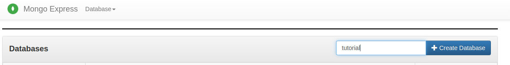

Respuesta:

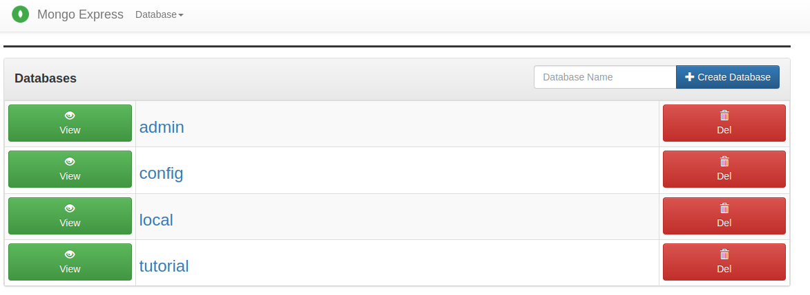

== Creación de colecciones

[.lead]
CREATE +
Crea nuevas colecciones donde se van a almacenar los datos.  

[source,javascript]
--
db.createCollection(nombre_de_la_colleccion);
--

Vamos a ver el ejemplo de la creación de la colección PROFESORES.

Comando para ejecutar en consola:

[source,javascript]
--
db.createCollection('PROFESORES');
--

Mongo express:

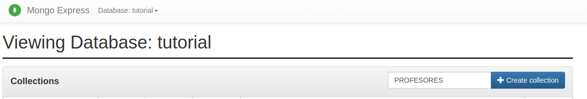

Respuesta: 

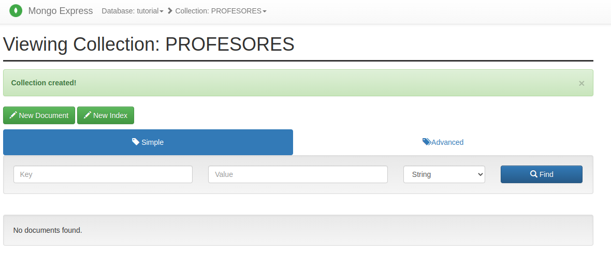

[.lead]
DROP +
Elimina una colecciones.  

[source,javascript]
--
db.nombre_de_la_colleccion.drop();
--

Vamos a ver el ejemplo de la creación de la colección PROFESORES.

Comando para ejecutar en consola:

[source,javascript]
--
db.PROFESORES.drop();
--

Mongo express:

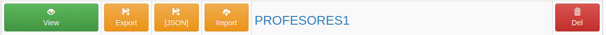

Respuesta: 

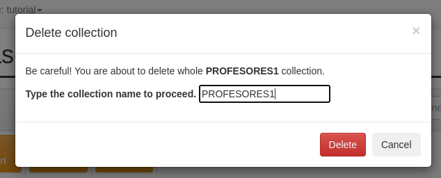

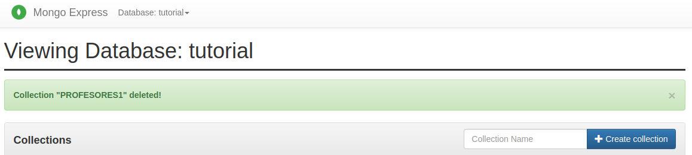

== INSERT, UPDATE, DELETE SQL

[.lead]
Insert

La instrucción INSERT permite crear o insertar nuevos documentos en una colección. Recordar que por defecto se crea un campo llamado *_id* con un valor único alfa númerico.

Comando para ejecutar en consola:

[source,javascript]
--
db.PROFESORES.insertOne({
  "ID": 10, 
  "NOMBRE": "Alonso", 
  "APELLIDOS": "Quijano", 
  "F_NACIMIENTO": "1547-07-29"}); 
--

El documento tiene formato json y lo podemos comparar con sql de la siguiente forma, cada clave del json es una columna y cada valor del json es el valor de la columna.

Mongo express: +
Debemos presionar el botón de *New Document* en color verde.

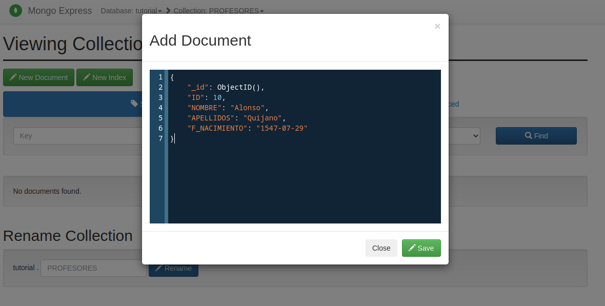

Respuesta: 

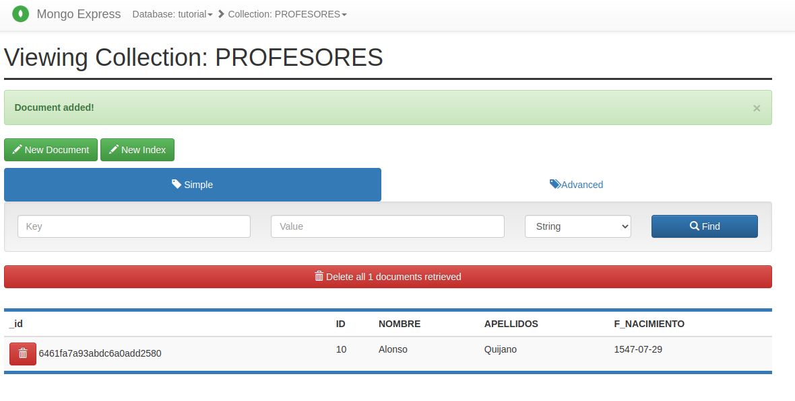

Observar como el campo *_id* toma el valor *6461fa7a93abdc6a0add2580*.

[.lead]
Update SQL

La instrucción UPDATE permite actualizar documentos de una colección. Debemos por lo tanto indicar que documentos se quiere actualizar mediante el primer argumento de la función (*{"ID": 10}*), y que campos mediante el segundo argumento (*{$set: {"APELLIDOS": "Quijano (Don Quijote)"}}*) 

Comando para ejecutar en consola:

[source,javascript]
--
db.PROSEFORES.updateOne(
  {"ID": 10},
  {$set: {"APELLIDOS": "Quijano (Don Quijote)"}});
--

Mongo express: +
Debemos hacer un click sobre el documento y modificamos los datos y finalmente presionamos *Save*.

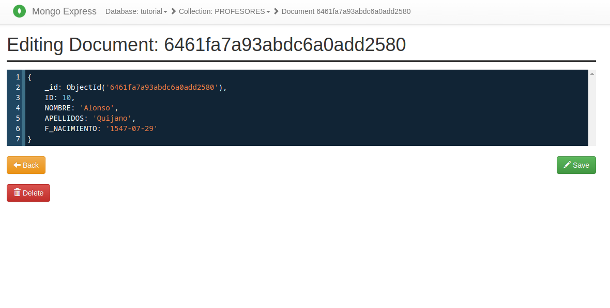

Respuesta: 

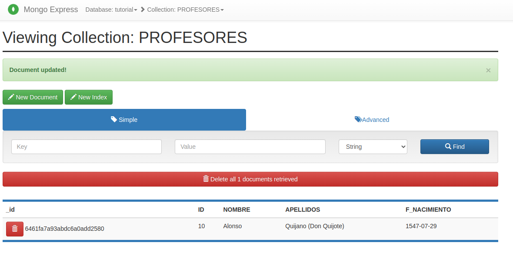

[.lead]
Delete SQL

La isntrucción DELETE permite eliminar documentos de una colección, su sintaxis es simple, puesto que solo debemos indicar que registros deseamos eliminar mediante el primer argumento de la función (*{"ID": 10}*).

Comando para ejecutar en consola:

[source,javascript]
--
db.PROSEFORES.deleteOne({"ID": 10});
--

Mongo express: +
Debemos presionar el botón delete en rojo.

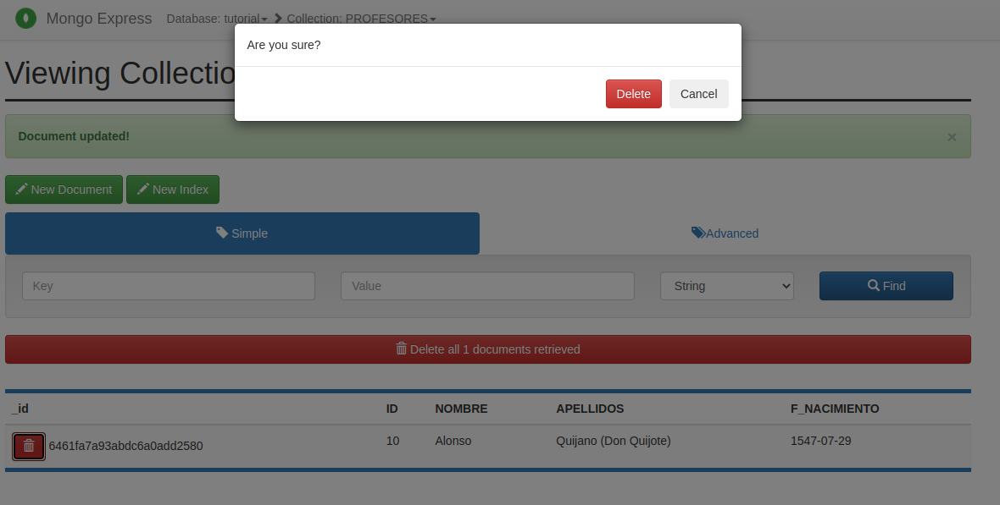

Respuesta: 

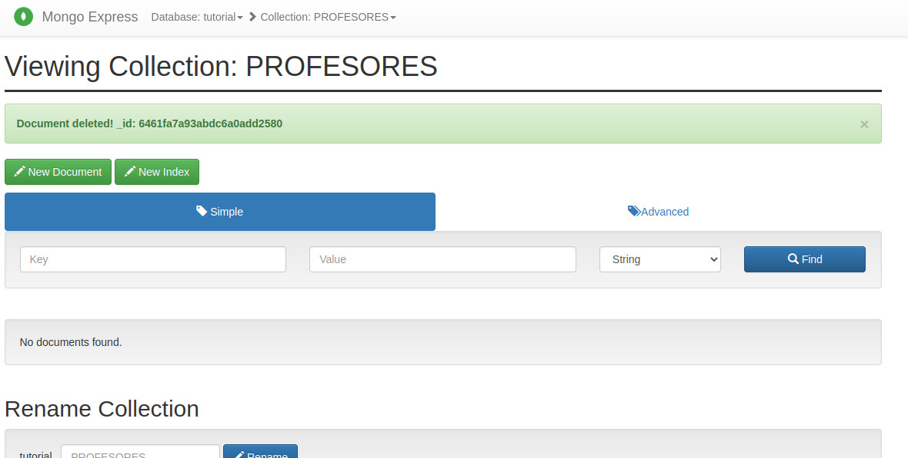

== Consultas SQL

Vamos a listar el nombre y los apellidos de los empleados que tienen un salario superior a 1350.

Comando para ejecutar en consola:

[source,javascript]
--
db.EMPLEADOS.find({SALARIO: {$gt:1350}}, {_id:0, NOMBRE: 1, APELLIDOS: 2})
--

Mongo express: 

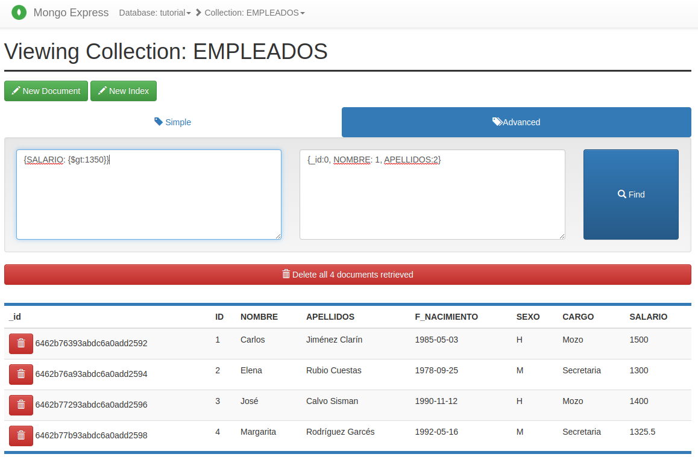

Resultado:

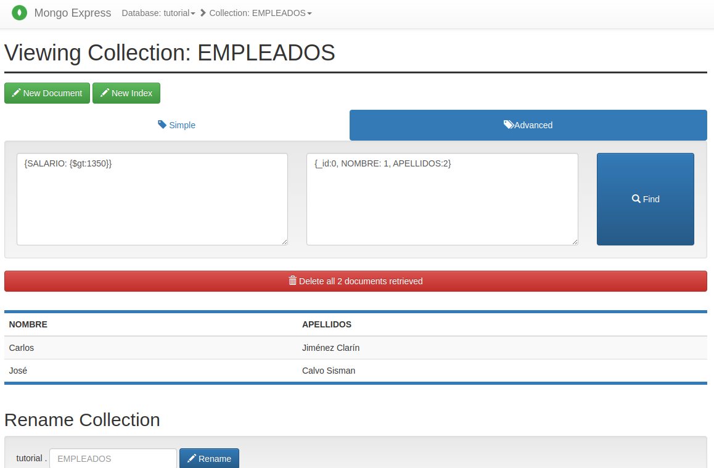

En este caso la función *find* recibe como primer argumento el filtro y como segundo parámetro las columnas que deseo obtener como respuesta. 

[.lead]
Filtro (query): {SALARIO: {$gt:1350}}

En este caso estamos filtrando la key o columna *SALARIO* para que sea mayor a 1350.

[.lead]
Campos retornados (projection): {_id:0, NOMBRE: 1, APELLIDOS:2}

Debemos el nombre de las keys (columnas) y la posición en que se van a mostrar. En caso de querer omitir el campo por defecto *_id* se lo debemos pasar en la posición 0 como muestra el ejemplo.

[.lead]
Modificando el filtro

Vamos a modificar el filtro para que nos muestre los empleados que tienen un salario entre 1350 y 1450.

Comando para ejecutar en consola:

[source,javascript]
--
db.EMPLEADOS.find({$and:[{SALARIO: {$lt:1450}},{SALARIO: {$gt:1350}}]}, {_id:0, NOMBRE: 1, APELLIDOS: 2})
--

Mongo express: 

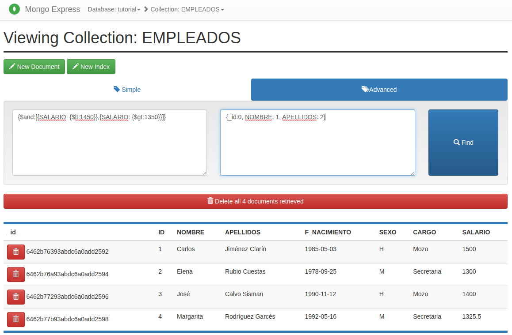

Resultado:

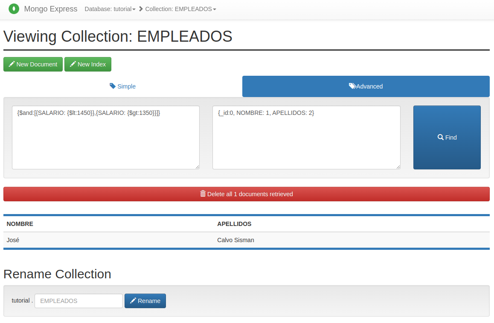

== Tipos de dato

Son los tipos de datos de javascript:

- string: Las cadenas de texto. Se utilizan con comillas dobles.

- int o long: Para representar números enteros y no llevan comillas dobles.

- decimal: Para representar números decimales y no llevan comillas dobles.

- date: Para representar fechas.

- datetime: Para representar fecha y hora.

- array: Arreglos de datos. Se utilizan los corchetes para representar un lista de valores o objetos.

- object: Objetos. Se utilizan las llaves.

*_Recordar que se trabajan con objetos javascript o json_*

== Operadores

Es un operador que opera normalmente entre dos operandos, estableciendo una operación que al ejecutarla se obtiene un resultado.

[.lead]
Lógica booleana

Nos permite establecer condiciones que pueden ser verdaderas o falsas. 

[.lead]
Expresiones booleanas

En la consulta

[source,javascript]
--
db.EMPLEADOS.find({SALARIO: {$gt:1350}}, {_id:0, NOMBRE: 1, APELLIDOS: 2})
--

dentro del filtro SALARIO > 1350, estamos estableciendo una expresión booleana donde ">" es el operador, "SALARIO" es un operando variable, que tomará valores de cada registro de la tabla EMPLEADOS, y "1350" es un operando constante. El resultado de esta expresión depende del valor que tome la variable SALARIO, pero en cualquier caso sólo puede dar dos posibles resultados, verdadero o falso.

[.lead]
Operadores

|===
| Símbolo | Descripción

| $eq
| Igual a

| $gt
| Mayor a

| $lt
| Menor a

| $gte
| Mayor o igual a

| $lte
| Menor o igual a
|===

[.lead]
Operadores lógicos

|===
| Símbolo | Descripción

| $and
| Operador y

| $or
| Operador o

| $not
| Operador no

| $nor
| Operador no
|===

.Tabla de verdad para el operador lógico NOT
|===
| A | Not A

|true
|false

|false
|true
|===

.Tabla de verdad para el operador lógico AND
|===
| A | B | A AND B

|*true*
|*true*
|*true*

|true
|false
|false

|false
|false
|false

|false
|true
|false
|===

.Tabla de verdad para el operador lógico OR
|===
| A | B | A OR B

|true
|true
|true

|true
|false
|true

|*false*
|*false*
|*false*

|false
|true
|true
|===

.Tabla de verdad para el operador lógico NOR
|===
| A | B | A NOR B
|true
|true
|false

|true
|false
|false

|*false*
|*false*
|*true*

|false
|true
|false
|===

[.lead]
El operador AND

¿qué personas son rubias y altas?, para ello construimos la siguiente consulta SQL:

Comando para ejecutar en consola:

[source,javascript]
--
db.PERSONAS.find({$and: [{RUBIA: "S"}, {ALTA: "S"}]}, {_id: 0, NOMBRE: 1})

db.PERSONAS.find({$and: [{RUBIA: {$eq: "S"}}, {ALTA: {$eq: "S"}}]}, {_id: 0, NOMBRE: 1})
--

Mongo express: 

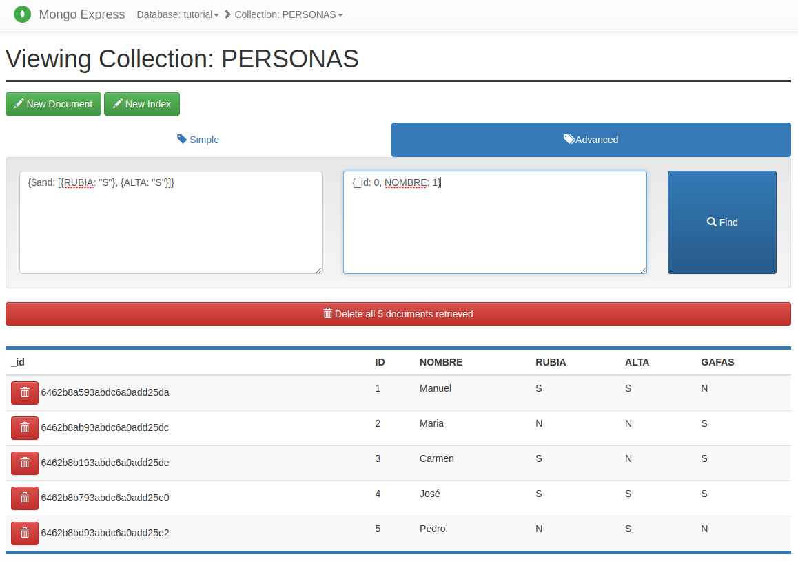

Resultado:

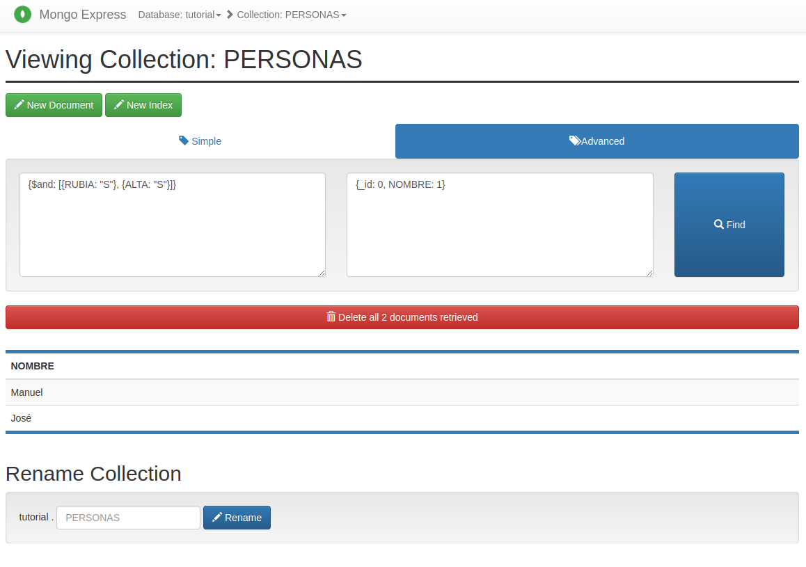

[.lead]
El operador OR

Supongamos que queremos saber las personas que son rubias o bien altas, es decir, queremos que si es rubia la considere con independencia de su altura, y a la inversa, también queremos que la seleccione si es alta independientemente del color de pelo. La consulta sería la siguiente.

Comando para ejecutar en consola:

[source,javascript]
--
db.PERSONAS.find({$or: [{RUBIA: "S"}, {ALTA: "S"}]}, {_id: 0, NOMBRE: 1})

db.PERSONAS.find({$or: [{RUBIA: {$eq: "S"}}, {ALTA: {$eq: "S"}}]}, {_id: 0, NOMBRE: 1})
--

Mongo express: 

image::./images/NOSQL_EXPRESS/image_020.png[Listado de las personas altas o rubias]

Resultado:

[.lead]
El operador NOT

Este operador tan solo tiene un operando, el resultado es negar el valor del operando.

Tomemos la anterior consulta y neguemos el filtro, si antes el resultado era: *Manuel, Carmen, José* y *Pedro* ahora el resultado ha de ser *María*.

Comando para ejecutar en consola:

[source,javascript]
--
db.PERSONAS.find({$nor: [{RUBIA: "S"}, {ALTA: "S"}]}, {_id: 0, NOMBRE: 1})
--

Mongo express: 

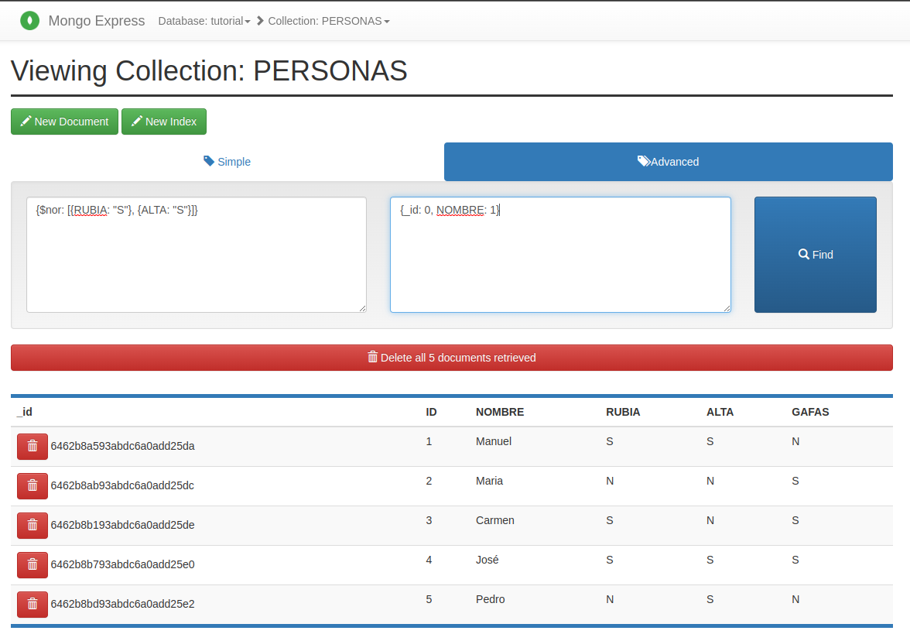

Resultado:

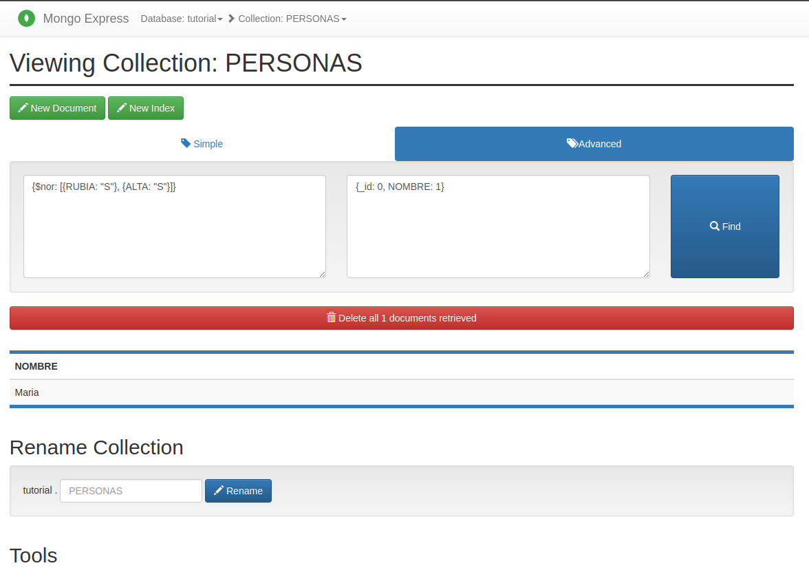

== Totalizar datos

Para este tipo de funciones utilizaremos las agregaciones.

¿Cuál es el salario medio de los empleados?

Comando para ejecutar en consola:

[source,javascript]
--
db.EMPLEADOS.aggregate([{$group: {_id: null, totalSalario: { $sum: "$SALARIO" }}}])
db.EMPLEADOS.aggregate({$group: {_id: null, totalSalario: { $sum: "$SALARIO" }}})
db.EMPLEADOS.find({$group: {_id: null, totalSalario: { $sum: "$SALARIO" }}})
db.EMPLEADOS.find([{$group: {_id: null, totalSalario: { $sum: "$SALARIO" }}}])

db.EMPLEADOS.aggregate([
  {
    $project: {
      totalSalario: { $sum: "$SALARIO" }
    }
  }])

--

Dentro de la función aggregate, utilizamos el operador $group para agrupar todos los documentos en una sola salida.
El campo _id se establece en null para agrupar todos los documentos sin considerar ningún campo específico.
Utilizamos el operador de acumulación $sum para sumar los valores del campo SALARIO.
El resultado de la suma se guarda en un nuevo campo llamado totalSalario.

Mongo consola: 

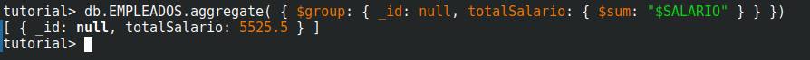

*_No todas las consultas funcionan por la aplicación mongo-express_*
La consulta la construiríamos así:

[source,javascript]
--
select sum(SALARIO)
from EMPLEADOS
--

Resultado:
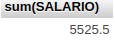

Fíjese que el resultado de esta consulta SQL devuelve una sola fila. 

Análogamente contamos el número de empleados, es decir, el número de registros de la tabla empleados.

[source,javascript]
--
select count(*)
from EMPLEADOS
--

Resultado:

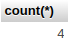

El asterisco que encontramos en "COUNT(\*)" equivale a decir: cualquier campo, fíjese que en este caso queremos contar registros, por lo tanto lo mismo nos da contar nombres, que apellidos, que cualquier otro campo. Veremos en otra lección las particularidades de la función COUNT aplicada a un solo campo, por ahora entandamos que "COUNT(*)" cuenta los registros seleccionados.

Ahora ya podemos resolver la cuestión planteada, basta con dividir el primer resultado por el segundo.

[source,javascript]
--
select sum(SALARIO)/count(*)
from EMPLEADOS
--

Resultado:

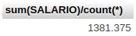

== Agrupación de datos (aggregate)

Para las agregaciones vamos a trabajar con los pipelines de mongodb, es decir, vamos a aplicar distintos acciones a la hora de realizar una consulta.

[.lead]
Cláusula GROUP BY *$group*

¿cuantos empleados de cada sexo hay?

[source,javascript]
--
db.EMPLEADOS.aggregate([{$group: {_id: "$SEXO", EMPLEADOS: { $sum: 1 }}}, {$project: {_id: 0, KEY_SEXO: "$_id", KEY_EMPLEADOS: "$EMPLEADOS"}}])
--

Resultado:

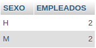

Observe que el resultado de la consulta devuelve dos objecto. Para realizar un cambio de nombre utilizamos el *$project*. +
El filtro es: {$group: {_id: "$SEXO", EMPLEADOS: { $sum: 1 }}}, agrupar por el *_id* que toma el valor de la key (columna) SEXO y se suma sobre una key llamada EMPLEADO. +
La proyección: {$project: {_id: 0, SEXO: "$_id", EMPLEADOS: 1}}, aqui se produce un renombre de campos, *_id: 0* indica que no se muestra el campo *_id*, luego la key KEY_SEXO la voy a tomar del valor del filtro *$_id* y el valor de la key KEY_EMPLEADOS la voy a tomar del filtro *$EMPLEADOS*.

En este caso el pipeline se construye de un filtro y de una proyección, la cual me permite renombrar las columnas.

[.lead]
La palabra clave DISTINCT

Con ella podemos eliminar filas redundantes de un resultado SQL, por lo que permite obtener los distintos valores de un campo existentes en una tabla o grupo de registros seleccionados.

Por ejemplo, ¿qué valores distintos existen en el campo SEXO de la tabla empleados?:

[source,javascript]
--
db.EMPLEADOS.aggregate([{ $group: { _id: "$SEXO" } }])
--

Resultado:

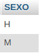

Utilizaremos la colleción MASCOTAS:

¿cuantos perros de cada sexo hay en total actualmente en el centro?

Consulta SQL:
[source,javascript]
--
db.MASCOTAS.aggregate([{$match: {ESPECIE: 'P',ESTADO: 'A'}}, {$group: {_id: '$SEXO', PERROS_VIGENTES: { $sum: 1 }}}])
--

Resultado:

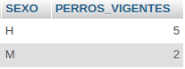

El resultado son dos machos y cinco hembras.

En este caso utilizamos la instrucción *$match* para hacer que se cumplan las condiciones de ESPECIE y ESTADO (tambíen lo podemos realizar con un *$and*) y luego agrupamos por la key SEXO.

== Filtrar cálculos de totalización (SQL HAVING)

Para aplicar los SQL HAVING se aplican los pipelines nuevamente.

[.lead]
Cláusula HAVING

¿Qué ubicaciones del centro de mascotas tienen más de dos ejemplares?

Consulta SQL:
[source,javascript]
-- 
db.MASCOTAS.aggregate([{ $match: { ESTADO: 'A' } },{ $group: { _id: "$UBICACION", EJEMPLARES: { $sum: 1 } } },{ $match: { EJEMPLARES: { $gt: 2 } } }])
--

Resultado:

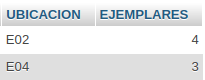

En este caso primero se filtran todos los documentos que poseen el ESTADO igual a A, luego agrupo los documentos por la key UBICACION y por último aplico un nuevo filtro donde la key EJEMPLARES sea mayor a 2.

== Ordenación del resultado (SQL ORDER BY)

La Cláusula ORDER BY nos permite ordenar las filas de resultado por una o más columnas. Esta cláusula no se presenta en última instancia por casualidad, sino por que siempre irá al final de una consulta osea antes de devolver el resultado.

Una última cláusula implica una última pregunta de construcción: + 
¿Cómo deben ordenarse los datos resultantes?

Supongamos que queremos obtener una lista ordenada de los empleados por sueldo, de modo que primero este situado el de menor salario y por último el de mayor:

[source,javascript]
--
db.EMPLEADOS.find({}, {_id:0, NOMBRE: 1, APELLIDOS: 1, SALARIO: 1 }).sort({ SALARIO: 1 })

db.EMPLEADOS.aggregate([{$sort: {SALARIO: 1}}, {$project: {_id:0, NOMBRE: 1, APELLIDOS: 2, SALARIO: 3 }}])
--

Resultado:

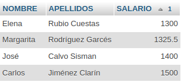

En este caso  vemos que podemos utilizar la función *sort* con el campo/s que deseamos utilizar para ordenar el listado. En este caso *SALARIO: 1* indica que se ordena de forma ascendente y si ponemos *SALARIO: -1* se ordena en forma descendente.

En este caso también puedo usar el aggregate con la orden *$sort* para poder utilizar el pipeline y obtener el mismo resultado.

[source,javascript]
--
db.EMPLEADOS.find({}, {_id:0, NOMBRE: 1, APELLIDOS: 1, SALARIO: 1 }).sort({ SALARIO: -1 })

db.EMPLEADOS.aggregate([{$sort: {SALARIO: -1}}, {$project: {_id:0, NOMBRE: 1, APELLIDOS: 2, SALARIO: 3 }}])
--

Resultado:

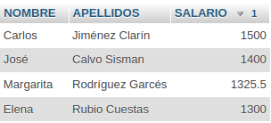

== La orden $regex (LIKE) / El valor NULL

[.lead]
La orden $regex

En esta caso la orden utiliza expresiones regulares y está limitada por el caracter */*, es decir, que una expresión regular comienza y termina con */*.

¿Qué empleados su primer apellido comienza por "R"?
Veamos primero la consulta SQL que responde a esto:

[source,javascript]
--
db.EMPLEADOS.find({ APELLIDOS: {$regex: /^R/ }})

db.EMPLEADOS.find({ APELLIDOS: /^R/ })
--

Resultado:

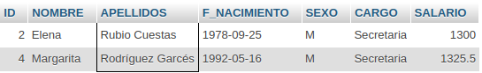

[source,javascript]
--
db.EMPLEADOS.find({ APELLIDOS: {$regex: /N$/ig }})

db.EMPLEADOS.find({ APELLIDOS: /N$/ig })
--

Resultado:

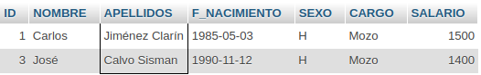

*_En este caso con ig hacemos que el texto sea key insensitive._*

Veamos una última aplicación de este recurso. + 
¿Qué devuelve esta consulta?:

[source,javascript]
--
db.EMPLEADOS.find({ APELLIDOS: {$regex: /.*AR.*/ig }})

db.EMPLEADOS.find({ APELLIDOS: /.*AR.*/ig })

db.EMPLEADOS.find({ APELLIDOS: /AR/ig })
--

Resultado:

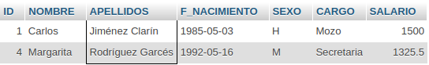

== Funciones

[.lead]
CONCAT +
Realiza la concatenación de dos o más cadenas de texto. Para este caso particular la orden *$concat* solo está disponible para el aggregate y recibe un array con los campos/strings a concatenar.

[source,javascript]
--
db.EMPLEADOS.aggregate([{$project: {_id: 0,NOMBRE_APELLIDOS: { $concat: ["$NOMBRE", " ", "$APELLIDOS"] }}}])
--

Resultado:

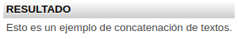

[.lead]
CURRENT_DATE +
Retorna la fecha del servidor.

[source,javascript]
--
db.EMPLEADOS.findOne({}, { localtime: { $dateToString: { format: "%Y-%m-%d %H:%M:%S", date: new Date() } } })
--

Resultado:

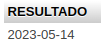

En este ejemplo estamos creando un objeto de tipo *Date* que tiene la fecha y hora del servidor y luego con la orden *$dateToString* le podemos dar formato.

[source,javascript]
--
db.EMPLEADOS.find({}, { ID: 1, NOMBRE: 1, APELLIDOS: 1, F_NACIMIENTO: 1, F_NACIMIENTO_FORMATEADA_DESDE_STRING: { $dateFromString: { format: "%Y-%m-%d", dateString: "$F_NACIMIENTO" } }, F_NACIMIENTO_PASADA_A_DATE_Y_FORMATEADA_A_STRING: { $dateToString: {format: "%d-%m-%Y", date: { $dateFromString: { format: "%Y-%m-%d", dateString: "$F_NACIMIENTO" } } }}})
--

Resultado:

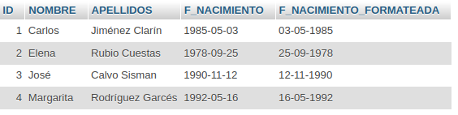

En este último ejemplo vemos como pasar un string que almacena una fecha a otro string con otro formato. La orden *$dateToString* pasa un objeto de tipo *Date* a un string y la key formato responde al formato que queremos que tenga la fecha, mientras que la orden *$dateFromString* pasa un string a un objeto del tipo *Date* y la key formato responde al formato que tiene el string.

[.lead]
DATE_ADD / DATE_SUB +
Se utiliza para agregar / quitar valores a las fechas. Como parámetros recibe la fecha y el intervalo de valor. Se pueden agregar  días, meses, años, horas, minutos.... Los intervalos pueden variar según el motor de base de datos.

[source,javascript]
--
db.EMPLEADOS.findOne({}, {
      FECHA_ACTUAL_MAS_TREINTA_DIAS: { $add: [new Date(), { $multiply: [30, 24, 60, 60, 1000] }] },
      FECHA_ACTUAL_MAS_SEIS_MESES: { $add: [new Date(), { $multiply: [6, 30, 24, 60, 60, 1000] }] },
      FECHA_ACTUAL_MENOS_TREINTA_DIAS: { $subtract: [new Date(), { $multiply: [30, 24, 60, 60, 1000] }] },
      FECHA_ACTUAL_MENOS_SEIS_MESES: { $subtract: [new Date(), { $multiply: [6, 30, 24, 60, 60, 1000] }] }
    }
)
--

Resultado:

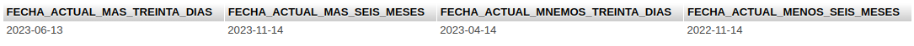

En este caso debemos utilizar las ordenes *$add*, *$subtract* y *$multiply* para sumar, restar o multiplicar valores. Al objeto *Date* le tenemos que sumar o restar el valor en milisegundos es por eso la lista de valores, por ejemplo [30 (días), 24 (horas), 60 (minutos), 60 (segundos), 1000 (milisegundos)], todos estos valores se multiplican y luego se suman al Date.

[.lead]
SUBSTR +
Retorna el substring de una cadena. Como parámetros recibe el dato de tipo cadena a tratar en primer lugar, seguido de la posición dentro de la cadena donde se quiere obtener la subcadena, y por último la longitud o número de caracteres de esta. Ejemplos:

[source,javascript]
--
db.EMPLEADOS.findOne({},  {_id: 0, Nombre: 1, NOMBRE_0_4: {$substr: ["$NOMBRE", 0, 4]}, "NOMBRE_1_3" : {$substr: ["$NOMBRE", 1, 3]}})
--

Resultado:

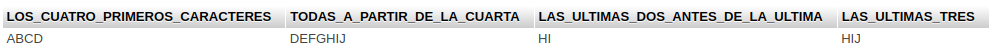

Para esto utilizamos la orden *$substr* que recibe como parámetros un arreglo con el string a cortar (en este caso utilizamos la columna $NOMBRE), la posición donde queremos empezar a cortar y la cantidad de caracteres que queremos obtener.

[.lead]
REPLACE +
Para este caso utilizamos la orden *$replace* que remplaza en una cadena un texto por otro. Le tenemos que pasar la key *input* donde se para el string a verificar, la key *find* donde le pasamos el string a buscar o ser reemplazaod y la key *replacement* con el string de reemplazo.

[source,javascript]
--
db.EMPLEADOS.find({}, {_id: 00, PRODUCTO: { $replaceAll: { input: "$NOMBRE", find: "a", replacement: "__" } }})
--

Resultado:

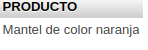

[.lead]
IF +
Es el condicional simple se implementa con la orden *cond* que recibe un objeto del con la key *if* que contiene la comparación, la key *then* con el valor del entonces o verdadero y la key *else* con el valor del sino entonces o falso de la comparación.

[source,javascript]
--
db.PERSONAS.find({}, {_id: 0, NOMBRE: 1, RUBIA: 1, RUBIA_IF: {$cond: {if: { $eq: ["$RUBIA", "S"] }, then: "Sí", else: "No"}}})
--

Resultado:

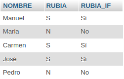

[.lead]
ROUND +
Para este caso vamos a utilizar la orden *$round* que recibe un array con el valor y la cantidad de decimales a redondear.

[source,javascript]
--
db.EMPLEADOS.find({}, {_id: 0, RETENCION: {$multiply: ["$SALARIO", 0.035]} , RETENCION_ROUND: { $round: [{$multiply: ["$SALARIO", 0.035]}, 2] }})
--

Resultado:

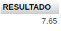

[.lead]
TRUNCATE +
Para este caso vamos a utilizar la orden *$trunc* que recibe un array con el valor y la cantidad de decimales a recortar.

[source,javascript]
--
db.EMPLEADOS.find({}, {_id: 0, RETENCION: {$multiply: ["$SALARIO", 0.035]} , RETENCION_ROUND: { $trunc: [{$multiply: ["$SALARIO", 0.035]}, 2] }})
--

Resultado:

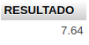

== Relación entre tablas

Como mencionamos anteriormente, este tipo de base de datos no es ideal para trabajar de esta forma a pesar de que algunos motores lo soporten.

Vamos a ver la colleción de cursos y profesores que en las bases de datos relacionadas tienen una relación.

[source,javascript]
--
db.PROFESORES.find()
--

Resultado:

[source,javascript]
--
db.CURSOS.find()
--

Resultado:

En caso de querer representar la misma relación, una opción seria

[source,javascript]
--
db.CURSOS_SIN_RELACION.find()
--

Resultado:

Notese que la key *ID_PROFE* fue reemplazada por *PROFESOR* y dentro de está última tenemos un objeto con los datos del profesor. Los datos del profesor se repiten cada vez que un profesor está a cargo de un curso.