= Bases de datos relacionales

*_Recordar que utilizaremos de ejemplo mysql._*

== Base de datos

Almacena en soportes informáticos una estructura lógica de almacenamiento, como la tiene un archivo de papel, por ejemplo: edificio, planta, pasillo, ubicación, ficha. De este modo es posible recuperar la información que interesa de un modo ágil, gracias a los íncides y la estructura organizada del archivo.

== Estructura mínima de almacenamiento

=== Tabla

Objeto de almacenamiento perteneciente a una BD. Es una estructura en forma de cuadrante donde se almacenan registros o filas de datos. Cada tabla tiene un nombre único en la base de datos (BD).

=== Registro

Cada una de las filas de una tabla, está compuesta por campos o atributos.

=== Campo

Cada uno de los datos almacenados. Cada campo tiene un nombre único para la tabla de la cual forma parte, además es de un tipo determinado.

Ejemplo de tabla EMPLEADOS:

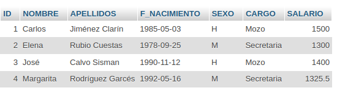

Cada registro contiene información de un empleado. En el ejemplo observamos que la tabla tiene un diseño de siete campos y que almacena cuatro registros. El nombre de cada campo viene dado por la fila de encabezado. El dato que contiene el campo ID identifica cada registro.

== Creación de una base de datos
[.lead]
CREATE +
Crea nuevas bases de datos donde se van a almacenar las tablas.  En general la sintaxis de la instrucción CREATE es la siguiente:

[source,sql]
--
CREATE DATABASE nombre_base_de_datos;
--

Vamos a ver el ejemplo de la creación de la base de datos tutorial.

[source,sql]
--
create database tutorial;
--

Luego debemos ingresar a la base de datos:

[source,sql]
--
use tutorial;
--

== Creación de tablas

[.lead]
CREATE +
Crea nuevas tablas donde se van a almacenar los datos.  En general la sintaxis de la instrucción CREATE es la siguiente:

[source,sql]
--
CREATE TABLE nombre_tabla (
  nombre_del_campo tipo_de_dato valor_por_defecto
);
--

Vamos a ver el ejemplo de la creación de las tablas de PROFESORES y CURSOS.

[source,sql]
--
create table `PROFESORES` (
  `ID` int unsigned not null,
  `NOMBRE` varchar(30) not null,
  `APELLIDOS` varchar(50) not null,
  `F_NACIMIENTO` date not null
);

create table `CURSOS` (
  `ID` int unsigned not null,
  `TITULO` varchar(50) not null,
  `ID_PROFE` int unsigned default null
);
--

En el caso de PROFESORES vemos que:

- ID es de tipo int unsigned (entero positivo) y no acepta valores nulos.
- NOMBRE es de tipo varchar con una longitud máxima de 30 caracteres y no admite valores nulos.
- APELLIDOS es de tipo varchar con una longitud máxima de 30 caracteres y no admite valores nulos.
- F_NACIMIENTO es de tipo date y no admite valores nulos.

[.lead]
ALTER +
Modifica las tablas o las columnas de las tablas. Por ejemplo me permite cambiar el nombre de las tablas o columnas, cambiar los tipos de datos o agregar constraints del tipo clave primario o foránea.

Vamos a agregar las claves primarias a ambas tablas. Para este caso solo debemos indicar el nombre de la tabla y el nombre del campo que va a ser la clave primaria.

[source,sql]
--
alter table `PROFESORES` add primary key (`ID`);
alter table `CURSOS` add primary key (`ID`);
--

Vamos a agregar la clave foránea. Para esto necesitamos el nombre de la tabla que va a contener la clave foránea (CURSOS), luego debemos elegir un nombre para esta restricción (CURSOS_FK_PROFESORES), debemos ingresar el nombre de la columna de la tabla que va a contener el valor de referencia (ID_PROFE) y por último agregar el nombre de la tabla (PROFESORES) y el nombre de la clave primaria (ID) que se va a relacionar.

[source,sql]
--
alter table `CURSOS`
      add constraint `CURSOS_FK_PROFESORES` foreign key (`ID_PROFE`) references `PROFESORES` (`ID`);
--

Vamos a agregar la columna *F_INICIO* a la tabla *CURSOS*, que tiene un tipo *datetime* y por defecto toma el valor *null*.

[source,sql]
--
alter table `CURSOS`
      add column `F_INICIO` datetime default null;
--

Vamos a modificar la columna *F_INICIO* a la tabla *CURSOS*, para que tenga un tipo *date* y por defecto toma el valor *null*.

[source,sql]
--
alter table `CURSOS`
      modify column `F_INICIO` date default null;
--

Vamos a eliminar la columna *F_INICIO* a la tabla *CURSOS*.

[source,sql]
--
alter table `CURSOS`
      drop column `F_INICIO`;
--

[.lead]
DROP +
Eliminación de tablas.

[source,sql]
--
drop table `PROFESORES`
--

== INSERT, UPDATE, DELETE SQL
[.lead]
Insert SQL +
La instrucción INSERT permite crear o insertar nuevos registros en una tabla. En general la sintaxis de la instrucción INSERT es la siguiente:

[source,sql]
--
INSERT INTO nombre_tabla (lista de campos separados por comas) 
                  VALUES (lista de datos separados por comas)
--

Veamos su sintaxis con un ejemplo práctico, la inserción de un registro en la tabla PROFESORES:

[source,sql]
--
insert into PROFESORES (ID , NOMBRE,   APELLIDOS,  F_NACIMIENTO) 
                values (10,  'Alonso', 'Quijano', '1547-07-29')
--  

Observe como todo lo que se explicó en referencia a los tipos de datos es valido para la instrucción INSERT. Los datos de tipo numérico no se entrecomillan, a diferencia de los datos de tipo cadena y fecha.

[.lead]
Update SQL +
La instrucción UPDATE permite actualizar registros de una tabla. Debemos por lo tanto indicar que registros se quiere actualizar mediante la cláusula WHERE, y que campos mediante la cláusula SET, además se deberá indicar que nuevo dato va a guardar cada campo. En general la sintaxis de la instrucción UPDATE es la siguiente:

[source,sql]
--
UPDATE nombre_tabla 
   SET campo1 = valor1,
       campo2 = valor2,
       ...
       campoN = valorM
WHERE condicines
--

Veamos un ejemplo para actualizar el APELLIDO de la tabla de PROFESORES.

[source,sql]
--
update PROFESORES
set APELLIDOS = 'Quijano (Don Quijote)'
where ID = 10
--

Todo lo expuesto sobre lógica booleana es valido para la clausula WHERE de la instrucción UPDATE, en todo caso dicha cláusula se comporta igual que en una consulta, solo que ahora en lugar de seleccionar registros para mostrarnos algunos o todos los campos, seleccionará registros para modificar algunos o todos sus campos. Por lo tanto omitir la cláusula WHERE en una instrucción UPDATE implica aplicar la actualización a todos los registros de la tabla.

La instrucción anterior asignará cambiará el APELLIDO del profesor.

[.lead]
Delete SQL +
La isntrucción DELETE permite eliminar regsitros de una tabla, su sintaxis es simple, puesto que solo debemos indicar que registros deseamos eliminar mediante la cláusula WHERE. En general la sintaxis de la instrucción DELETE es la siguiente:

[source,sql]
--
DELETE FROM nombre_tabla
WHERE condiniones
-- 

La siguiente consulta elimina el ID igual a 10:

[source,sql]
--
delete from PROFESORES
where ID = 10
--  

== Consultas SQL

Abordemos las consultas SQL con un caso práctico. Sobre la tabla EMPLEADOS se plantea la siguiente cuestión:

¿Qué empleados tienen un salario mayor a 1350?

La respuesta es simple: José y Carlos tiene un salario mayor a 1350.

Vamos pues a construir la consulta que nos permita responder a esta cuestión, las preguntas mínimas para construir una consulta SQL son:

. ¿Qué datos nos están pidiendo? +
En este caso, el nombre y el apellido de cada empleado.

. ¿Dónde están los datos? +
 Están en la tabla EMPLEADOS.

. ¿Qué requisitos deben cumplir los registros? + 
 El sueldo debe ser superior a 1350.

La construcción final sería:
Seleccionar el NOMBRE y el APELLIDO de la tabla EMPLEADOS cuyo SALARIO sea superior a 1350.

[.lead]
Sintaxis SQL 

NOTE: El doble guión se utiliza para realizar comentarios dentro del código sql.

[source,sql]
----
select NOMBRE , APELLIDOS -- Seleccionar el NOMBRE y el APELLIDO
from EMPLEADOS -- de la tabla EMPLEADOS
where SALARIO > 1350 -- cuyo SALARIO sea superior a 1350
----

Resultado:

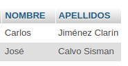

[.lead]
Forma general

[source,sql]
--
select CAMPOS (separados por comas)
from TABLA
where CONDICIÓN
--

[.lead]
Ampliando la explicación +
Fijémonos ahora en las tres cláusulas de la anterior consulta SQL y que relación guardan con las preguntas de construcción:

- _Cláusula SELECT_: Donde indicamos los campos de la tabla que queremos obtener, separados por comas. _Responde a la pregunta_: ¿Qué datos nos piden?

- _Cláusula FROM_: Donde indicamos en que tabla se encuentran estos campos. _Responde a la pregunta_: ¿Dónde están los datos?

- _Cláusula WHERE_: Donde establecemos la condición que han de cumplir los registros de la tabla que serán seleccionados. _Responde a la pregunta_: ¿Qué requisitos deben cumplir lo registros? Es de hecho donde se establece el filtro de registros, es decir, que registros serán considerados para mostrar sus datos y cuales no.

[.lead]
Modificando la cláusula where +
Imaginemos ahora la siguiente cuestión: ¿Qué empleados tienen un sueldo comprendido entre 1350 y 1450?

Si nos hacemos las preguntas de construcción:
¿Qué datos nos piden?
¿Dónde están los datos?
¿Qué requisitos deben cumplir los registros?

Observamos que para las dos primeras preguntas las respuestas son idénticas a la anterior cuestión, pero para la tercera es distinta. Esto nos indica que las cláusulas SELECT y FROM no van a cambiar respecto a la anterior consulta, y sólo lo hará la cláusula WHERE, así que podemos tomar la anterior consulta como patrón y modificarla para adaptarla a lo que se nos pide ahora.

Antes el salario debía ser mayor a 1350, ahora debe estar comprendido entre 1350 y 1450, ambos inclusive. La cláusula WHERE la construiremos de la siguiente manera:

[source,sql]
--
select NOMBRE , APELLIDOS
from EMPLEADO
where SALARIO >= 1350 and SALARIO <= 1450
--

El resultado es:

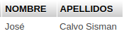

=== El operador between

Existe otro modo de obtener la mismo resultado aprovechando más los recursos del SQL mediante el operador BETWEEN (entre). La consulta es equivalente y quedaría de la siguiente manera:

[source,sql]
--
select NOMBRE , APELLIDOS
from EMPLEADOS
where SALARIO between 1350 and 1450
--

El resultado es:

*Ejercicio*:

Intente hallar una consulta que devuelva el nombre y apellidos de los empleados que cobren menos de 1350 euros.

El resultado esperado es:

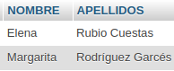

== Tipos de dato

Los más comunes son:

- Cadena: VARCHAR(tamaño) +
Las cadenas de texto son de tipo VARCHAR, y su tamaño máximo para un campo concreto se especifica indicando su longitud entre paréntesis. Por ejemplo: Al diseñar la tabla EMPLEADOS, se debe valorar que longitud máxima se establece para el campo NOMBRE, de manera que pueda albergar cualquier nombre de persona que se pueda dar. En el caso de la tabla EMPLEADOS se decidió que como mucho un nombre no sobrepasa las 30 letras o caracteres, de modo que el tipo de dato para este campo se definió como: VARCHAR(30). Es decir, en el campo NOMBRE de la tabla EMPLEADOS se puede guardar cualquier cadena alfanumérica de hasta 30 caracteres. +
Cuando indicamos constantes en una consulta SQL, las cadenas de texto a diferencia de los números, y ahora estamos hablando del dato en sí y no del tipo, siempre se entrecomillarán para indicar que se trata de un dato de tipo cadena y no de un dato de tipo número.

[source,sql]
----
select SALARIO
from EMPLEADOS
where APELLIDOS = 'Rubio Cuestas' -- notar como se utilizan las cadenas de caracteres
----

- Número entero: INT +
A diferencia del tipo VARCHAR, donde establecemos el tamaño máximo, para los números enteros existen varios tipos de dato de tamaño fijo, elegiremos uno u otro en función del tamaño máximo que necesitamos establecer. Cuando tratamos números es más correcto hablar de rango que de tamaño, es decir, bajo que rango de valores( máximo y mínimo) podemos operar con ese tipo. Como hicimos con el tipo cadena, nos quedaremos con uno para simplificar: el tipo INT. +
Ejemplo de número decimal: 3467

- Número decimal: FLOAT (coma flotante) +
Para los números decimales también existen varios tipos de dato con diferente rango de valores posibles, la parte entera la separamos por un punto de la parte decimal. Asumiremos que solo existe el tipo FLOAT, con un rango de valores posibles suficientemente amplio. Y como aunque decimal no deja de ser un número, NO debe entrecomillarse en las Consultas SQL. +
Ejemplo de número decimal: 3467.00

- Fecha: DATE +
El tipo DATE tiene el tamaño apropiado para registrar un dato de: año + mes + día. Existe también el tipo DATATIME, por ejemplo, que además del día registra la hora. +
Un dato de tipo DATE y/o DATETIME se expresa en forma de cadena con un formato determinado, de modo que quien procesa ese dato sabe cual es el año, el día o el mes en función de la posición que ocupa en la cadena alfanumérica. +
Por ejemplo, tenemos el siguiente dato: 4 de noviembre de 2006, para expresar este dato debemos hacerlo de la siguiente forma: 'aaaammdd' donde aaaa indica cuatro dígitos para el año, mm dos dígitos para el mes y dd dos dígitos para el día. De modo que el 4 de noviembre de 2006 lo expresaríamos así: '20061104'. +
Al expresarse en forma de cadena, o si usted quiere, como una cadena con un formato concreto y sus posibles valores restringidos a una fecha valida, debe siempre entrecomillarse cuando aparece como constante en una consulta SQL.

Ejemplo: +
Vamos a mostrar los tipos de datos de la tabla EMPLEADOS y para esto utilizamos la instruacción *desc*.

[source,sql]
-- 
desc EMPLEADOS;
--

El resultado es:

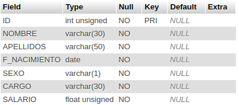

_Debemos observar las columnas 'Field' y 'Type'._

== Operadores

Es un operador que opera normalmente entre dos operandos, estableciendo una operación que al ejecutarla se obtiene un resultado.

[.lead]
Lógica booleana +
Nos permite establecer condiciones que pueden ser verdaderas o falsas. 

[.lead]
Expresiones booleanas +
En la consulta

[source,sql]
--
select NOMBRE , APELLIDOS
from EMPLEADOS
where SALARIO > 1350
--

dentro de la clausula WHERE: SALARIO > 1350(¿es SALARIO mayor a 1350?), estamos estableciendo una expresión booleana donde ">" es el operador, "SALARIO" es un operando variable, que tomará valores de cada registro de la tabla EMPLEADOS, y "1350" es un operando constante. El resultado de esta expresión depende del valor que tome la variable SALARIO, pero en cualquier caso sólo puede dar dos posibles resultados, verdadero o falso.

[.lead]
Operadores +
Algunos de los operadores que nos permiten construir expresiones booleanas son:

- *>*: "A > B" devuelve verdadero si A es estrictamente mayor que B, de lo contrario devuelve falso.
- *<*: "A < B" devuelve verdadero si A es estrictamente menor que B, de lo contrario devuelve falso.
- *=*: "A = B" devuelve verdadero si A es igual a B, de lo contrario devuelve falso.
- *>=*: "A >= B" devuelve verdadero si A es mayor o igual a B, de lo contrario devuelve falso.
- *\<=*: "A \<= B" devuelve verdadero si A es menor o igual a B, de lo contrario devuelve falso.
- *!=*: "A != B" devuelve verdadero si A es distinto a B, de lo contrario devuelve falso.

Al construir expresiones con estos operadores, los dos operandos deben ser del mismo tipo, ya sean números, cadenas o fechas.

Ejemplo de expresión booleana con cadenas: 

 ('Aranda, Pedro' < 'Zapata, Mario' ) = verdadero, por que según el orden alfabético 'Aranda, Pedro' está posicionado antes que 'Zapata, Mario' , por lo tanto es menor el primero que el segundo.

[.lead]
Operadores lógicos +
Los operadores lógicos permiten formar expresiones booleanas tomando como operandos otras expresiones booleanas. Fíjese que en las expresiones vistas anteriormente, los operandos debían ser números, cadenas o fechas, ahora sin embargo los operandos deben ser expresiones booleanas, el conjunto forma una nueva expresión booleana que, como toda expresión booleana, dará como resultado cierto o falso.

- *AND*: "A and B" devuelve verdadero si A y B valen cierto, y falso en cualquier otro caso.
- *OR*: "A or B" devuelve verdadero si A o B valen cierto, y falso únicamente cuando tanto A como B valen falso.
- *NOT*: "not A" devuelve falso si A vale verdadero, y cierto si A vale falso.

.Tabla de verdad para el operador lógico NOT
|===
| A | Not A

|true
|false

|false
|true
|===

.Tabla de verdad para el operador lógico AND
|===
| A | B | A AND B

|*true*
|*true*
|*true*

|true
|false
|false

|false
|false
|false

|false
|true
|false
|===

.Tabla de verdad para el operador lógico OR
|===
| A | B | A OR B

|true
|true
|true

|true
|false
|true

|*false*
|*false*
|*false*

|false
|true
|true
|===

[.lead]
Veamos ahora esto mismo aplicado al SQL: +
Consideremos ahora la tabla PERSONAS, donde hemos guardado una "S" en el campo RUBIA si la persona es rubia y una "N" en caso contrario, análogamente se ha aplicado el mismo criterio para ALTA y GAFAS, es decir, para indicar si es alta y si lleva gafas.

Consulta a la tabla PERSONAS

[source,sql]
--
select *
from PERSONAS
--

Resultado de la consulta:

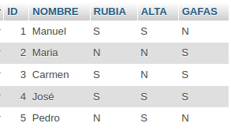

[.lead]
El operador AND +
Vamos responder a la siguiente pregunta  

¿qué personas son rubias y altas?, para ello construimos la siguiente consulta SQL:

[source,sql]
--
select NOMBRE
from PERSONAS
where (RUBIA = 'S') and (ALTA = 'S')  
--

Resultado:

[.lead]
El operador OR +
Supongamos que queremos saber las personas que son rubias o bien altas, es decir, queremos que si es rubia la considere con independencia de su altura, y a la inversa, también queremos que la seleccione si es alta independientemente del color de pelo. La consulta sería la siguiente.

[source,sql]
--
select NOMBRE
from PERSONAS
where (RUBIA = 'S') or (ALTA = 'S')   
--

Resultado:

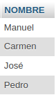

[.lead]
El operador NOT +
Este operador tan solo tiene un operando, el resultado es negar el valor del operando. +
Tomemos la anterior consulta y neguemos la clausula WHERE, si antes el resultado era: *Manuel, Carmen, José* y *Pedro* ahora el resultado ha de ser *María*.

[source,sql]
--
select NOMBRE
from PERSONAS
where not (RUBIA = 'S' or ALTA = 'S')
--

Resultado:

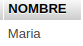

== Totalizar datos

¿Cuál es el salario medio de los empleados?

Bien, si recuperamos las preguntas de construcción que tanto nos ayudan para construir nuestras consultas SQL:
¿Qué datos nos piden?
¿Dónde están los datos?
¿Qué requisitos deben cumplir los registros?
A la pregunta: ¿Dónde están los datos?, se nos plantea una duda. El dato que nos piden es: “el salario medio de los empleados”, pero este dato no está en ninguna tabla, entonces ¿Cómo resolvemos el problema? Afortunadamente el SQL nos permite calcularlo, para calcular el salario medio basta con sumar todos los salarios y dividirlo por el número de empleados. Esto es posible hacerlo mediante la funciones SUM(suma) y COUNT(contar) de SQL.

Obtengamos primero la suma de salarios, para ello nos hacemos las preguntas de construcción:

¿Qué datos nos piden?
La suma de los salarios.

¿Dónde están los datos?
En la tabla empleados.

¿Qué requisitos deben cumplir los registros?
Ninguno, queremos sumar todos los salarios por lo tanto no hemos de filtrar registros, los seleccionaremos todos, o lo que es lo mismo, omitiremos la cláusula WHERE de la consulta SQL.

La consulta la construiríamos así:

[source,sql]
--
select sum(SALARIO)
from EMPLEADOS
--

Resultado:
image::./images/SQL/image_010.png[Sumatoria total de salarios]

Fíjese que el resultado de esta consulta SQL devuelve una sola fila. 

Análogamente contamos el número de empleados, es decir, el número de registros de la tabla empleados.

[source,sql]
--
select count(*)
from EMPLEADOS
--

Resultado:

image::./images/SQL/image_011.png[Cantidad total de resitros en la tabla]

El asterisco que encontramos en "COUNT(\*)" equivale a decir: cualquier campo, fíjese que en este caso queremos contar registros, por lo tanto lo mismo nos da contar nombres, que apellidos, que cualquier otro campo. Veremos en otra lección las particularidades de la función COUNT aplicada a un solo campo, por ahora entandamos que "COUNT(*)" cuenta los registros seleccionados.

Ahora ya podemos resolver la cuestión planteada, basta con dividir el primer resultado por el segundo.

[source,sql]
--
select sum(SALARIO)/count(*)
from EMPLEADOS
--

Resultado:

image::./images/SQL/image_012.png[Salario medio de los empleados]

== Alias de campo

El nombre de columna "sum(SALARIO) / count(*)". Pero estamos de acuerdo en que no podría entregarse un informe de esa forma. Para solucionar esto el SQL pone a su disposición la palabra clave AS, que permite rebautizar con un alias a las columnas o tablas involucradas en la consulta.

[source,sql]
--
select sum(SALARIO) / count(*) as MEDIA_SALARIOS
from EMPLEADOS 
--

Resultado:

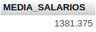

[.lead]
Sigamos con la totalización de datos. 

Acabábamos de explicar como calcular la media de salarios de la tabla EMPLEADOS. El asunto ha quedado resuelto, pero en realidad nos hemos complicado la vida. +
Para esto vamos a utilizar la función de promedio.

[source,sql]
--
select avg(SALARIO) as MEDIA_SALARIOS_AVG
from EMPLEADOS
--

Resultado:

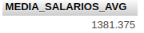

También podemos utilizar funciones de máximo y mínimo, ahora vamos a obtener el salario máximo y el mínimo.

[source,sql]
--
select max(salario) as SALARIO_MAXIMO, min(salario) as SALARIO_MINIMO
from EMPLEADOS
--

Resultado:

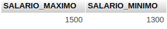

== Agrupación de datos (SQL GROUP BY)

En el punto anterior vimos como responder a la pregunta: ¿cuantos empleados hay? La respuesta es en realidad el total de registros de un solo grupo que podemos llamar: empleados. Puede responder también a la pregunta: ¿cuantos hombres hay? La respuesta no deja de ser el total de registros de un solo grupo que podemos llamar: hombres. 

[.lead]
Cláusula GROUP BY +
Construyamos una consulta que nos devuelva el total de empleados por sexo. Esto se consigue con una nueva cláusula: GROUP BY, en consecuencia debemos añadir una cuarta pregunta a las preguntas de construcción:

¿Qué datos nos piden? +
El número de empleados.

¿Dónde están los datos? +
En la tabla empleados.

¿Qué requisitos deben cumplir los registros? +
Ninguno, necesitamos que intervengan todos los registros.

¿Cómo debemos agrupar los datos? +
Por sexo.

[source,sql]
--
select SEXO, count(*) as EMPLEADOS
from EMPLEADOS
group by SEXO
--

Resultado:

image::./images/SQL/image_016.png[Total de empleados por sexo]

Observe que el resultado de la consulta devuelve dos filas, una para los hombres y otra para las mujeres, cada fila indica el número de empleados de su grupo. Advierta como los grupos resultantes son dos porque los distintos valores del campo SEXO en los registros seleccionados son dos: "H" y "M".

En general, cuando acompañamos uno o más campos de tabla con funciones de totalización, estos campos deberán formar parte de la cláusula GROUP BY. Un campo por el que agrupamos puede omitirse en la cláusula SELECT, aunque entonces, como puede apreciarse en el próximo ejemplo, ignoramos a que grupo representa cada fila de resultado.

[source,sql]
--
select count(*) as EMPLEADOS
from EMPLEADOS
group by SEXO
--

Resultado:

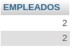

Pero si un campo aparece en la clausula SELECT junto con funciones de totalización, entonces debemos forzosamente agrupar por ese campo, o lo que es lo mismo, debe formar parte de la clausula GROUP BY.

[.lead]
La palabra clave DISTINCT +
Con ella podemos eliminar filas redundantes de un resultado SQL, por lo que permite obtener los distintos valores de un campo existentes en una tabla o grupo de registros seleccionados.

Por ejemplo, ¿qué valores distintos existen en el campo SEXO de la tabla empleados?:

[source,sql]
--
select distinct SEXO
from EMPLEADOS
--

Resultado:

image::./images/SQL/image_018.png[Distintos tipos de sexo]

En general pondremos la palabra clave DISTINCT delante de la lista de campos de la cláusula SELECT para eliminar las filas de resultados duplicadas o redundantes.

Para seguir viendo el potentísimo recurso SQL que es la agrupación de datos, vamos a suponer que usted gestiona un centro de acogida de mascotas, a él llegan perros y gatos abandonadas o de gente que no puede hacerse cargo. Para cada nueva mascota que llega al centro creamos un nuevo registro en la tabla MASCOTAS. Cuando una mascota es acogida por alguien, damos el registro de baja para indicar que esa mascota ha abandonado el centro.

Diseño de la tabla MASCOTAS:

Descripción de los campos:
ID_MASCOTA: Número o identificador de mascota.
NOMBRE: Nombre de la mascota.
ESPECIE: Campo codificado donde se guarda "P" para perro y "G" para gato.
SEXO: Campo codificado donde se guarda "M" para macho y "H" para hembra.
UBICACION: Jaula o estancia donde está ubicada la mascota.
ESTADO: Campo codificado donde se guarda "A" para alta en el centro y "B" para baja en el centro.

Echemos un vistazo a la tabla MASCOTAS:

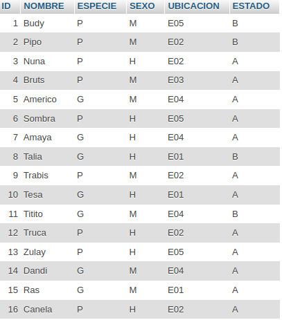

Planteemos la siguiente cuestión: ¿cuantos perros de cada sexo hay en total actualmente en el centro?
Para construir la consulta SQL nos ayudamos de las preguntas de construcción:

¿Qué datos nos piden? +
El número de perros.

¿Dónde están los datos? +
En la tabla mascotas

¿Qué requisitos deben cumplir los registros? +
Deben ser perros y estar de alta en el centro.

¿Cómo debemos agrupar los datos? +
Por sexo.

Consulta SQL:
[source,sql]
--
select SEXO,count(*) as PERROS_VIGENTES
from MASCOTAS
where ESPECIE = 'P' and ESTADO = 'A'
group by SEXO
--

Resultado:

image::./images/SQL/image_020.png[Total de mascotas por sexo]

El resultado son dos machos y cinco hembras.

Más ejemplos: +
¿Cuantos ejemplares contiene actualmente en cada jaula o ubicación?

¿Qué datos nos piden? +
El numero de ejemplares.

¿Dónde están los datos? +
En la tabla mascotas

¿Qué requisitos deben cumplir los registros? +
Las mascotas deben estar de alta en el centro.

¿Cómo debemos agrupar los datos? +
Por ubicación.

Consulta SQL:
[source,sql]
--
select UBICACION , count(*) as EJEMPLARES
from MASCOTAS
where ESTADO = 'A'
group by UBICACION
--

Resultado:

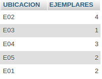

Obsérvese como en este caso la consulta SQL devuelve cinco filas, o lo que es lo mismo, cinco grupos resultantes. Esto es debido a que el campo UBICACIÓN contiene cinco distintos valores de entre los registros seleccionados.

Veamos ahora un ejemplo donde se agrupa por dos campos. 

Supongamos la siguiente cuestión: ¿cuantos ejemplares de cada especie, y dentro de cada especie de cada sexo, hay actualmente en el centro?

Para construir la consulta SQL nos ayudamos de las preguntas de construcción:

¿Qué datos nos piden? +
El número de ejemplares.

¿Dónde están los datos? +
En la tabla mascotas

¿Qué requisitos deben cumplir los registros? +
Deben estar de alta en el centro.

¿Cómo debemos agrupar los datos? +
Por especie y por sexo.

Consulta SQL:
[source,sql]
--
select ESPECIE , SEXO , count(*) as EJEMPLARES_VIGENTES
from MASCOTAS
where ESTADO = 'A'
group by ESPECIE , SEXO
--

Resultado:

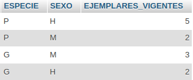

El resultado son dos machos y cinco hembras para los perros, y tres machos y dos hembras para los gatos.

Pongamos otro ejemplo, pero esta vez planteémoslo al revés: 

¿Qué devuelve la siguiente consulta SQL?:

Consulta SQL:

[source,sql]  
--
select UBICACION , ESPECIE ,  SEXO , count(*) as EJEMPLARES_VIGENTES
from MASCOTAS
where ESTADO = 'A'
group by UBICACION , ESPECIE , SEXO
--

Resultado:
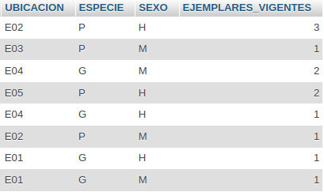

Observamos que el resultado de la consulta anterior devuelve datos totalizados en tres grupos, responde al número de ejemplares por especie y sexo que hay en cada ubicación.

== Filtrar cálculos de totalización (SQL HAVING)

Si se plantea la siguiente cuestión: ¿Qué ubicaciones del centro de mascotas tienen más de dos ejemplares? Usted podría responder a la tercera pregunta de construcción: ¿Qué requisitos deben cumplir los registros?, lo siguiente: "que la ubicación tenga más de dos ejemplares"; y esa respuesta sería errónea. Esta pregunta nos la formulamos para construir la cláusula WHERE y aplicar filtros a los registros de la tabla, pero como el número de ejemplares de cada ubicación no lo tenemos en ninguna tabla, sino que debemos calcularlo, no podemos aplicar ese filtro en la cláusula WHERE. ¿Dónde entonces?, pues obviamente debemos filtrar las filas de resultados, es decir, de todas las filas resultantes ocultar las que no nos interesen y mostrar el resto. Puede verse como un filtro en segunda instancia, una vez el motor a resuelto la consulta y siempre ajeno a la tabla de datos. Para ello existe una nueva cláusula: HAVING, y en consecuencia una nueva pregunta de construcción: ¿qué requisitos deben cumplir los datos totalizados?

[.lead]
Cláusula HAVING +
¿Qué ubicaciones del centro de mascotas tienen más de dos ejemplares? +
Construyamos la consulta SQL que resuelve la cuestión planteada con ayuda da las preguntas de construcción:

¿Qué datos nos piden? +
Las ubicaciones.

¿Dónde están los datos? +
En la tabla mascotas.

¿Qué requisitos deben cumplir los registros? +
Ubicaciones que contengan mascotas de alta en el centro.

¿Cómo debemos agrupar los datos? +
Por ubicación.

¿Que requisito han de cumplir los datos totalizados? +
Que el número de ejemplares de las ubicaciones sea mayor a dos.

Consulta SQL:
[source,sql]
-- 
select UBICACION , count(*) as EJEMPLARES
from MASCOTAS
where ESTADO = 'A'
group by UBICACION
having count(*) > 2
--

Resultado:

image::./images/SQL/image_024.png[Más de 2 mascotas por ubicación]

De las cinco ubicaciones que existen en el centro, solo dos cumplen la condición de la cláusula HAVING. Esta cláusula es de hecho como la cláusula WHERE, pero en lugar de filtrar registros de la tabla, filtra filas de resultado en función de las condiciones que establezcamos sobre las columnas de resultado. En realidad este recurso se usa casi exclusivamente para establecer condiciones sobre las columnas de datos totalizados, puesto que los demás valores, los que están en la tabla, los debemos filtrar en la clausula WHERE.

A fin de ser prácticos consideraremos la clausula HAVING como una cláusula WHERE para los cálculos de totalización. De modo que lo que filtraremos aquí serán cosa del estilo: que la suma sea inferior a..., que la media sea igual a..., que el máximo sea superior a...., o como en el ejemplo: que el recuento de registros sea superior a dos. Siempre sobre cálculos de totalización. Por lo tanto si no hay cláusula GROUP BY, tampoco habrá cláusula HAVING.

[.lead]
Diferencia entre WHERE y HAVING +
El *WHERE* es la comparación del los campos a la hora de obtener la información deseada, mientras que *HAVING* es la ocultación de los datos obtenidos. Lo prodríamos ver como que WHERE es un pre procesamiento de los datos y HAVING un post procesamiento de los datos.

Por ejemplo: +
La siguiente consulta SQL cuenta los ejemplares de alta de la ubicaciones E02 y E03.

[source,sql]
--
select UBICACION , count(*) as EJEMPLARES
from MASCOTAS
where ESTADO = 'A' and (UBICACION = 'E02' or UBICACION = 'E03')
group by UBICACION
--

La tabla MASCOTAS tiene 16 registros. La consulta primero reduce los datos de la tabla al estado 'A' y a las ubicaciones  'E02' o 'E03', lo que nos devuelve un nuevo espacio de trabajo o tabla con 5 registros que son los que cumplen con la condición del WHERE y sobre este nuevo espacio se realiza el conteo. 

[source,sql]
--
select UBICACION , count(*) as EJEMPLARES
from MASCOTAS
where ESTADO = 'A'
group by UBICACION
having UBICACION = 'E02'  or UBICACION = 'E03' 
--

La segunda consulta reduce los datos de la tabla al estado 'A', lo que nos devuelve un nuevo espacio de trabajo o tabla con 12 registros que son los que cumplen con la condición del WHERE y sobre este nuevo espacio se realiza el conteo para luego ocultar los registros que no cumplen con la condición del HAVING. 

Resultado:

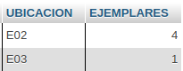

El resultado de ambas consultas SQL es el mismo, pero hacer lo segundo es no entender el propósito de cada cláusula. Para no caer en este error basta con filtrar siempre las filas de resultado únicamente condicionando columnas de totalización en la cláusula HAVING.

== Ordenación del resultado (SQL ORDER BY)

La Cláusula ORDER BY nos permite ordenar las filas de resultado por una o más columnas. Esta cláusula no se presenta en última instancia por casualidad, sino por que siempre irá al final de una consulta osea antes de devolver el resultado.

Una última cláusula implica una última pregunta de construcción: + 
¿Cómo deben ordenarse los datos resultantes?

Supongamos que queremos obtener una lista ordenada de los empleados por sueldo, de modo que primero este situado el de menor salario y por último el de mayor:

[source,sql]
--
select NOMBRE,APELLIDOS,SALARIO
from EMPLEADOS
order by SALARIO
--

Resultado:

image::./images/SQL/image_026.png[Tabla ordenada por salario de menor a mayor]

Observamos como introduciendo la cláusula ORDER BY e indicando la columna por la que ordenar, el resultado viene ordenado de forma ascendente (ASC), es decir, de menor a mayor. ¿Y si queremos ordenar a la inversa, de mayor a menor? Bien, en ese caso se debe indicar que la ordenación es descendente (DESC). Veamos esto tomando como patrón la consulta anterior:

[source,sql]
--
select NOMBRE,APELLIDOS,SALARIO
from EMPLEADOS
order by SALARIO desc
--

Resultado:

image::./images/SQL/image_027.png[Tabla ordenada por salario de mayor a menor]

Por tanto si seguido del campo por el que queremos ordenar indicamos ASC, o bien no indicamos nada, la ordenación se hará de forma ascendente, mientras que si indicamos DESC, se hará de forma descendente.

Veamos un ejemplo donde se ordena por más de un campo. Tomemos por ejemplo la tabla MASCOTAS, y obtengamos una lista de los perros que han pasado por el centro, de modo que primero aparezcan las bajas, y al final las altas, o perros que siguen en el centro. Además queremos que en segundo término la lista este ordenada por nombre:

[source,sql]
--
select *
from MASCOTAS
where ESPECIE = 'P'
order by ESTADO desc, NOMBRE asc
--

Resultado:

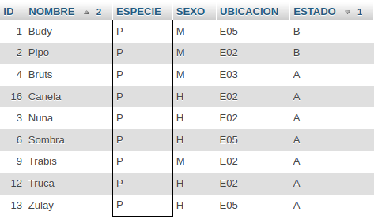

== El operador LIKE / El valor NULL

[.lead]
El operador LIKE +
Este operador se aplica a datos de tipo cadena y se usa para buscar registros, es capaz de hallar coincidencias dentro de una cadena bajo un patrón dado, por ejemplo:

¿Qué empleados su primer apellido comienza por "R"? +
Veamos primero la consulta SQL que responde a esto:

[source,sql]
--
select *
from EMPLEADOS
where APELLIDOS like 'R%' 
--

Resultado:

image::./images/SQL/image_029.png[Tabla con los apellidos que comienzan con R]

El interés de la anterior consulta se centra en la expresión: APELLIDOS like 'R%' donde "like" es el operador, APELLIDOS es el operando variable que toma valores para cada registro de la tabla EMPLEADOS, y el operando constante: "R%", es un patrón de búsqueda donde el "%" representa un comodín que junto con el operador LIKE tiene el cometido de reemplazar a cualquier cadena de texto, incluso la cadena vacía, para evaluar la expresión booleana. De modo que cualquier valor que haya en el campo APELLIDOS que empiece por una "R" seguida de cualquier cosa(%) dará cierto para la expresión: APELLIDOS like 'R%'.

Veamos otro ejemplo: ¿Qué empleados su segundo apellido termina en "N"?
En este caso interesa que el campo APELLIDOS empiece por cualquier cosa y acabe con una "N", por lo tanto la expresión que nos filtrará adecuadamente esto es: APELLIDOS like '%N'

[source,sql]
--
select *
from EMPLEADOS
where APELLIDOS like '%N' 
--

Resultado:

image::./images/SQL/image_030.png[Tabla con los apellidos que terminan en N]

Veamos una última aplicación de este recurso. + 
¿Qué devuelve esta consulta?:

[source,sql]
--
select *
from EMPLEADOS
where APELLIDOS like '%AR%' 
--

Resultado:

image::./images/SQL/image_031.png[Tabla con los apellidos que contiene AR]

Pues está devolviendo aquellos registros que el campo APELLIDOS contiene la cadena: "AR", ya sea al principio, al final, o en cualquier posición intermedia. De ahí que en el patrón de búsqueda encontremos la cadena "AR" acompañada de comodines a ambos lados.

[.lead]
El valor NULL +
Cuando se diseña una tabla en la base de datos, una de las propiedades que se establece para los campos de la tabla es si pueden contener o no un valor nulo. Por ejemplo, supongamos que tenemos una flota de vehículos. En la tabla VEHICULOS se guardan los datos de cada unidad, datos como el modelo, que obviamente no puede ser nulo puesto que todo vehículo pertenece a un modelo, pero también por ejemplo la fecha de la última revisión obligatoria, cuyo valor sí puede ser nulo, especialmente si el vehículo es nuevo y todavía nunca se ha sometido a dicha revisión. Por tanto ya se ve que hay campos que no pueden ser nulos y otros sí, dependiendo de que información se guarda.

Para ilustrar las particularidades del valor NULL tomemos la tabla VEHICULOS:

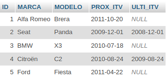

En los Datos se observa como tres de las cinco unidades nunca han pasado la revisión obligatoria, puesto que el valor para el campo ULTI_ITV (última inspección técnica del vehículo) es nulo.

El operador IS NULL +
Este operador permite establecer en la cláusula WHERE de una consulta SQL condiciones para filtrar por campos de valor nulo, por ejemplo: ¿Qué vehículos nunca han pasado la ITV?

[source,sql]
--
select *
from VEHICULOS
where ULTI_ITV is null
--

Resultado:

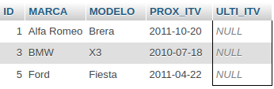

Los vehículos que han pasado como mínimo una vez la ITV serán aquellos que el campo ULTI_ITV no contenga un valor nulo, para conocer estos datos debemos establecer la siguiente condición:

[source,sql]
--
select *
from VEHICULOS
where ULTI_ITV is not null
--

Resultado:

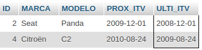

Por tanto ya se ve que el valor nulo es un poco especial, en realidad es un valor indeterminado, una muestra de ello es la excepción que se da a la afirmación que se hizo en la lección 5 sobre operadores: "si negamos la cláusula WHERE de una consulta SQL con el operador NOT, se obtienen los registros que antes se ignoraban y se ignoran los que antes se seleccionaban".

Veamos una muestra de ello. La siguiente consulta SQL devuelve los vehículos que pasaron la ITV durante el 2008:
[source,sql]
--
select *
from VEHICULOS
where ULTI_ITV between '20080101' and '20081231' 
--

Resultado:

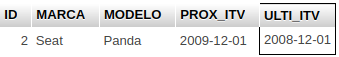

Es de esperar entonces que al negar la cláusula WHERE obtengamos todos los registros menos el Seat Panda:
[source,sql]
--
select *
from VEHICULOS
where not (ULTI_ITV between '20080101' and '20081231') 
--

Resultado:

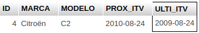

Sin embargo no ocurre así; la consulta ha devuelto los vehículos que NO pasaron la revisión durante el 2008, pero los registros con valor nulo en el campo ULTI_ITV han vuelto a ser ignorados. De modo que si anteriormente se quería obtener todos los vehículos que NO pasaron la ITV durante el 2008, debe plantearse si se incluyen los vehículos que NO la han pasado nunca, y si se decide que sí, debe especificarse en la cláusula WHERE:

[source,sql]
--
select *
from VEHICULOS
where not (ULTI_ITV between '20080101' and '20081231')
      or ULTI_ITV is null
--

Resultado:

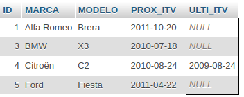

Para finalizar la lección retomemos algo que quedó pendiente, me refiero de la función de recuento COUNT aplicada a un campo concreto. Hasta ahora solo habíamos usado COUNT(*), fíjese en la consulta siguiente:

[source,sql]
--
select count(*) , count(ID) , count(ULTI_ITV)
from VEHICULOS
--

Resultado:

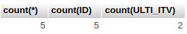

¿Que está devolviendo? Bueno en la primera columna el recuento de registros de toda la tabla puesto que se ha omitido la cláusula WHERE. En la segunda columna, donde se hace un recuento del campo ID parece que lo mismo, el número de registros de toda la tabla. Pero en la tercera columna, donde se hace el recuento del campo ULTI_ITV, el valor del recuento es dos. En realidad esta contando registros cuyo valor en el campo ULTI_ITV no es nulo, dicho de otro modo, la función de recuento COUNT aplicada a un campo, ignora los registros donde el valor de ese campo es nulo.
Esto es extensible a las otras funciones de totalización: SUM, AVG, MAX y MIN, los valores nulos no se pueden comparar ni sumar, no pueden intervenir en un promedio, no son valores máximos ni mínimos, son simplemente valores nulos.

== El producto cartesiano (SQL FROM)

Si trasladamos esto al ámbito que nos ocupa de las bases de datos, una tabla es en realidad un conjunto de registros, y al realizar una consulta como la siguiente el motor SQL realiza el producto cartesiano de ambos conjuntos, combinando todos los registros de la CAMISAS con todos los registros de la PANTALONES, de manera que cada fila de resultado es una de las combinaciones posibles. Por tanto el número de filas resultantes será igual al número de registros de la CAMISAS multiplicado por el número de registros de la PANTALONES.

Para ilustrar esto vamos a considerar estas dos tablas:

Tabla CAMISAS:

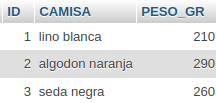

Tabla PANTALONES:

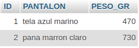

En estas tablas se guardan el vestuario de camisas y pantalones por separado, cada prenda tiene un número que la identifica y un peso expresado en gramos. +
Si ahora nos preguntamos lo siguiente: +
¿Qué combinaciones ofrece este vestuario? La respuesta es el producto cartesiano de ambas tablas:

[source,sql]
--
select *
from CAMISAS , PANTALONES
--

Resultado:

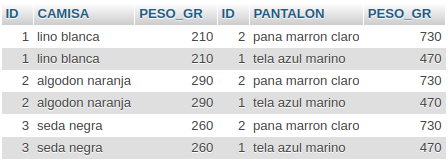

[.lead]
Campo ambiguo +
La ambigüedad se da cuando en una consulta SQL de por ejemplo dos tablas, en ambas existen uno o más campos con el mismo nombre, y estos campos aparecen en cualquier cláusula de la consulta.

En el ejemplo anterior podemos observar que los campos ID y PESO_GR son campos ambiguos y se confunden a que tabla pertenecen. Para evitar esto utilizaremos los alias y debemos indicar a que tabla pertenece cada campo.

[source,sql]
--
select CAMISAS.ID as ID_CAMISA, CAMISAS.CAMISA, CAMISAS.PESO_GR as PESO_GR_CAMISA, PANTALONES.ID as ID_PANTALON, PANTALONES.PANTALON, PANTALONES.PESO_GR as PESO_GR_PANTALON
from CAMISAS , PANTALONES
--

Resultado:

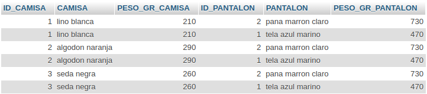

[.lead]
Alias de tabla +
Al igual que el SQL permite rebautizar columnas de la cláusula SELECT, también permite rebautizar tablas de la cláusula FROM. Para ello se emplea de igual modo la palabra clave AS. Se consigue así que las consultas sean menos laboriosas de construir, menos tupidas y más simplificadas a la vista del desarrollador. Por ejemplo:

[source,sql]
--
select C.ID ID_CAMISA, C.CAMISA, C.PESO_GR PESO_GR_CAMISA, P.ID ID_PANTALON, P.PANTALON, P.PESO_GR PESO_GR_PANTALON
from CAMISAS C, PANTALONES P
--

Resultado:

Al igual que con los alias de campo, no es necesario indicar la palabra clave AS para establecer un alias.

[.lead]
CONCAT +
Es una función que concatena datos de tipo cadena dando como resultado una única cadena. No debe confundirse esta función con las funciones de totalización (SUM , AVG ....). En este caso en particular se puede utilizar con *concat* o con *||*.

[source,sql]
--
select concat('Camisa de ' , C.CAMISA , ' con pantalón de ' , P.PANTALON) as MUDA, C.PESO_GR + P.PESO_GR 
from CAMISAS C , PANTALONES P 
order by C.ID , P.ID;
--

[source,sql]
--
select 'Camisa de ' || C.CAMISA || ' con pantalón de ' || P.PANTALON as MUDA, C.PESO_GR + P.PESO_GR 
from CAMISAS C , PANTALONES P 
order by C.ID , P.ID;
--

Resultado:

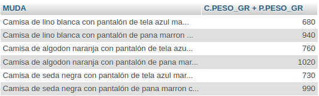

== Consultas Avanzado (SQL SELECT FROM WHERE)

Una tabla está formada por un conjunto de registros con un cierto número de campos. Podemos afirmar también que el producto cartesiano entre dos tablas está formado por un conjunto de filas de datos con un cierto número de columnas. Si se abstraen estos dos conceptos, ¿no se está hablando de lo mismo?

Tabla virtual MUDAS, ya que es el producto cartesiano de CAMISAS y PANTALONES:

La siguiente consulta SQL:

[source,sql]
--
select *
from MUDAS
where ID_CAMISA = 1
--

mostraría únicamente las mudas con la camisa de lino blanca, es decir, la camisa con identificador igual a 1, si no fuese porque la tabla MUDAS no existe en la BD. Lo que aparenta ser una tabla es en realidad el resultado de la siguiente consulta SQL:

[source,sql]
--
select C.ID_CAMISA , C.CAMISA , C.PESO_GR as PESO_CAMISA, P.ID_PANTALON , P.PANTALON , P.PESO_GR as PESO_PANTALON
from CAMISAS C , PANTALONES P
--

Por tanto diremos que: +
Cuando se cruzan tablas en una consulta SQL, a efectos lógicos, el producto cartesiano de dichas tablas se puede considerar como una nueva tabla con tantos registros y campos como filas y columnas resuelva la operación, siendo válido sobre estos registros y campos todo lo expuesto anteriormente.

La consulta SQL que devuelve las mudas de la camisa con identificador 1 quedaría de la siguiente manera:

[source,sql]
--
select C.ID, C.CAMISA, C.PESO_GR as PESO_CAMISA, P.ID, P.PANTALON, P.PESO_GR as PESO_PANTALON
from CAMISAS C , PANTALONES P
where C.ID = 1
--

Resultado:

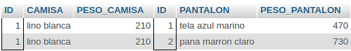

[.lead]
Funciones de totalización 

¿Cuantas mudas se pueden confeccionar con las camisas y pantalones?

[source,sql]
--
select count(*) as COMBINACIONES
from CAMISAS , PANTALONES
--

Resultado:

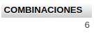

Un recurso de la función COUNT es la de contar sobre un campo: los distintos valores que contiene, en lugar de contar todos los valores que contiene la columna. Por ejemplo:

[source,sql]
--
select count(*) , count(CAMISA) , count(distinct CAMISA) , count(distinct PANTALON)
from CAMISAS , PANTALONES
--

Resultado:

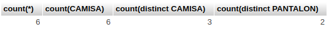

COUNT(*) cuenta filas resultantes, COUNT(camisa) cuenta los datos de la columna CAMISA que no son nulos, en este caso coincide con el número de filas resultantes, COUNT(DISTINCT camisa) cuenta los distintos valores que presenta la columna CAMISA, como sólo hay tres camisas distintas, el resultado de esta totalización es tres y COUNT(DISTINCT pantalon) cuenta los distintos valores que presenta la columna PANTALON, como sólo hay 2 pantalones distintos, el resultado de esta totalización es dos.

[.lead]
Cláusula WHERE +
En todos los filtros que se han establecido en las cláusulas WHERE de las consultas SQL en este curso, hasta ahora, siempre se han condicionado campos con constantes. La potencia del SQL va más allá, pudiendo si interesa comparar o condicionar campos de un mismo registro, o fila resultante de un producto cartesiano, entre sí. Siguiendo con el conjunto resultante de combinar las camisas con los pantalones, supongamos que interesa seleccionar aquellas mudas que el pantalón y la camisa son del mismo color. Al establecer esta condición se está reduciendo el numero de elementos resultantes, puesto que ahora de todas las mudas solo se seleccionarán aquellas que ambas prendas sean del mismo color. Esto se consigue con ayuda de la cláusula WHERE. Volviendo al símil del archivo, a nuestro ayudante le pediríamos para este propósito lo siguiente:

Selecciona todas las mudas confeccionables del archivo PANTALONES y CAMISAS donde el COLOR del PANTALON sea el mismo que el COLOR de la CAMISA.

Como en las tablas no tenemos guardado el color, para ilustrar esto supongamos que las camisas tiene un orden o prioridad que viene dado por su identificador (1 , 2 , ...), para los pantalones consideramos lo mismo:

¿Que mudas o combinaciones son aquellas que la primera camisa se combina con el primer pantalón, la segunda camisa con el segundo pantalón, y así sucesivamente?

Para ello se tiene que dar que el identificador de la camisa sea el mismo que el del pantalón, por tanto:
[source,sql]
--
select C.ID, C.CAMISA, C.PESO_GR as PESO_CAMISA, P.ID, P.PANTALON, P.PESO_GR as PESO_PANTALON  
from CAMISAS C, PANTALONES P
where C.ID = P.ID
--

Resultado:

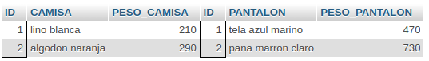

[.lead]
Uniones (UNION ALL) +
Existe un modo de unir los resultados de dos o más consultas colocando entre ellas la palabra clave: UNION ALL.

Prendas de la maleta:
[source,sql]
--
select concat('Camisa de ',CAMISA) as PRENDA
from CAMISAS
union all
select concat('Pantalón de ',PANTALON)
from PANTALONES
--

Resultado:

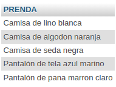

Obsérvese como para realizar la operación de unión, es necesario que ambas devuelvan el mismo número de columnas, de lo contrario la consulta SQL es en conjunto errónea.

Una variante de UNION ALL es indicar para este mismo propósito UNION a secas, esta opción eliminará del resultado filas duplicadas, es decir, si de entre las consultas implicadas existen filas repetidas, al realizar la unión solo se quedará con una.

== Relaciones, claves primarias y foráneas

Las Relaciones es lo que, aparte de dar el nombre a las BD relacionales, hacen de este modelo una potente herramienta de reunión de datos. Para abordar las relaciones debemos tratar primero el concepto de clave primaria y clave foránea, puesto que son estas claves las que establecen las relaciones en una BD, y realizan la reunión de datos mediante consultas SQL.

[.lead]
Clave primaria +
Es un identificador único para toda la tabla, generalmente se realiza con un valor númerico incremental. Este valor no se puede volver a repetir nunca dentro del campo en cuestión.

[.lead]
Clave foránea +
La clave o claves foráneas de una tabla son referencias a registros de otra tabla, formándose entre ambas tablas una relación. Una registro de la tabla que tiene la clave foránea, llamemoslo registro hijo, apunta a un solo registro de la tabla a la que hace referencia, llamemoslo registro padre. Por tanto, una clave foránea apuntará siempre a la clave primaria de otra tabla.

[.lead]
Relaciones +
El modo de relacionar registros entre tablas es por tanto mediante referencias, para lo cual se usan los identificadores definidos como claves primarias y foráneas.

Supongamos una academia donde se imparten clases, en consecuencia habrá cursos, profesores y alumnos. En nuestra base de datos diseñamos una tabla para cada entidad, es decir, para alumnos, profesores y cursos. Veamos como se relacionan entre si estas tres entidades y como se establecen estas relaciones en la base de datos.

Intuitivamente usted puede resolver la siguiente relación: La academia oferta cursos que imparten los profesores a los alumnos matriculados, y está en lo cierto, pero para relacionar esto en una BD debemos conocer en que medida se relacionan entre si estas tres entidades, es lo que se llama cardinalidad de una relación. Veamos primero el diseño de las tablas, los datos que contienen, y que campo, o campos, juegan el papel de identificador o clave primaria.
Los campos clave se han bautizado con el prefijo ID, abreviación de identificador.

TABLA PROFESORES

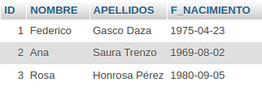

TABLA CURSOS

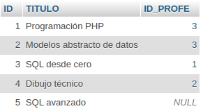

TABLA ALUMNOS

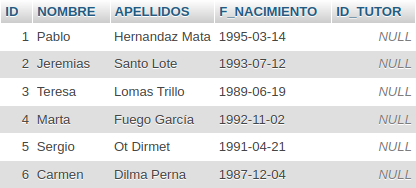

A estas tablas se las llama "maestros", dado que contienen información relevante y concreta de cada entidad, así hablaremos del maestro de profesores o del maestro de alumnos. Bien, para establecer las relaciones entre estas tres tablas necesitamos conocer con algo más de detalle la actividad en la academia, de modo que después de investigar un poco sacamos las siguientes conclusiones:

- Cada curso lo imparte un único profesor, sin embargo algún profesor imparte más de un curso.
- Cada curso tiene varios alumnos, y algunos alumnos cursan dos o más cursos.

[.lead]
Relación de cardinalidad 1 a N +
Establezcamos la siguiente relación: +
Cada curso lo imparte un único profesor, sin embargo algún profesor imparte más de un curso.

Para ello basta con crear un campo en la tabla CURSOS que informe que profesor lo imparte. Este dato es una clave primaria de la tabla PROFESORES alojada en la tabla CURSOS, de ahí lo de clave foránea, por tanto el campo que ejercerá de clave foránea en la tabla CURSOS debe ser forzosamente una referencia a la clave primaria de la tabla PROFESORES.
Este tipo de relación se denomina de uno a varios, también denominada de 1 a N: un profesor imparte varios cursos, pero un curso es impartido por un único profesor. En estos casos siempre se diseña una clave foránea en la tabla hijo(CURSOS) que apunta a la tabla padre(PROFESORES).

Debemos diseñar entonces una clave foránea en la tabla CURSOS para alojar valores que son clave primaria de la tabla PROFESORES. En este caso diseñaremos un campo que llamaremos ID_PROFE, aunque se podría llamar de cualquier otro modo, que contendrá el identificador de profesor que imparte el curso que representa cada registro. Veamos como queda la tabla CURSOS:

Observando los datos de la tabla se aprecia como efectivamente cada curso lo imparte un único profesor, y que algún profesor imparte más de un curso. También se observa como uno de los curso no se le ha asignado profesor, dado que el campo ID_PROFE esta a nulo. Por lo tanto una clave foránea apuntará a un solo registro de la tabla padre o no apuntará a ninguno, en cuyo caso guardará un valor indeterminado o nulo, pero jamás contendrá un valor que no exista en la tabla padre.

A usted se le puede ocurrir que es mucho más práctico y simple guardar para cada curso el nombre del profesor en lugar de claves que apenas nos dicen nada a simple vista. Esto sería transgredir la filosofía de las BD relacionales, que defienden la no duplicidad de información. El nombre de un profesor debe estar en el maestro de profesores, y cualquier referencia a ellos debe hacerse mediante su identificador. Con ello conseguimos tres cosas destacables:

- No se duplica información en la BD.
- Cualquier cambio o corrección de esa información solo debe realizarse en un único lugar.
- Evitamos la ambigüedad al no llamar la misma cosas de mil formas distintas en mil ubicaciones posibles.

Veamos la consulta que reune el nombre de cada profesor junto al curso que imparte.

[source,sql]
--
select *
from CURSOS C, PROFESORES P 
where C.ID_PROFE = P.ID_PROFE 
--

Resultado:

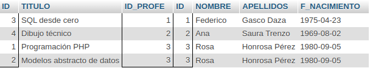

[.lead]
Relación de cardinalidad N a M +
Establezcamos la siguiente relación: +
Cada curso tiene varios alumnos, y algunos alumnos cursan dos o más cursos.

Esta relación es un poco más laboriosa de establecer en la base de datos, puesto que un alumno cursa varios cursos, y a su vez, un curso es cursado por varios alumnos. Este tipo de relación se denomina de varios a varios, o bien, de N a M. Necesitamos crear una nueva tabla denominada tabla de relación, y que tiene como propósito definir la relación de N a M. La nueva tabla: ALUMNOS_CURSOS, contendrá como mínimo las claves primarias de ambas tablas: ID_ALUMNO e ID_CURSO. La clave primaria de la nueva tabla la formaran ambos campos conjuntamente, y a su vez cada uno de ellos por separado será clave foránea de la tabla ALUMNOS y CURSOS respectivamente.

Tabla ALUMNOS_CURSOS:

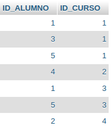

Fijese que esta tabla contiene únicamente referencias. Cada registro establece una relación, está relacionando un registro de la tabla CURSOS con un registro de la tabla ALUMNOS.

Veamos la consulta que realiza la reunión de los alumnos con los cursos que cursa cada uno:
[source,sql]
--
select *
from ALUMNOS_CURSOS AC, ALUMNOS A, CURSOS C
where AC.ID_ALUMNO = A.ID
  and AC.ID_CURSO  = C.ID
--

Resultado:

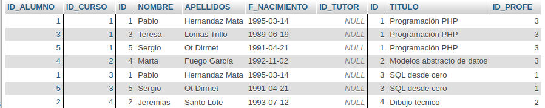

Una lista de esto mismo mejor presentada:
[source,sql]
--
select C.TITULO CURSO , concat(A.APELLIDOS,', ',A.NOMBRE ) ALUMNO
from ALUMNOS_CURSOS AC, ALUMNOS A, CURSOS C
where AC.ID_ALUMNO = A.ID
  and AC.ID_CURSO  = C.ID
order by C.TITULO , A.NOMBRE , A.APELLIDOS
--

Resultado:

image::./images/SQL/image_055.png[Tabla de relación formateada]

[.lead]
Relación de cardinalidad 1 a 1 +
No vamos a extendernos en esta tipo de relación puesto que no suelen darse mucho. En cualquier caso estas relaciones pueden verse como una relación 1 a N donde la N vale uno, es decir como una relación padre hijos donde el hijo es hijo único. En estos casos, cuando sólo se espera un hijo por registro padre, podemos montar la clave foránea en cualquiera de las dos tablas, aunque lo más correcto es establecerla en la tabla que NO es maestro. A efectos prácticos lo mismo da que el padre a punte al hijo que, a la inversa, es decir, que el hijo apunte al padre, o si usted quiere, cual de las dos tablas juega el papel de padre y cual de hijo. Lo importante es saber como se ha establecido la relación para atacarla mediante SQL al construir las consultas, pero siempre es preferible que la tabla maestro juegue el papel de padre.

== Reunión interna y externa (INNER / OUTER JOIN)

[.lead]
Reunión interna - cláusulas inner join / on +
Esta cláusula está diseñada precisamente para reunir registros de varias tablas, en ella intervienen las claves primarias y foráneas, y no intervienen, o lo hacen en la cláusula WHERE, los filtros propiamente dichos. Veamos una de las consultas que se expuso en la lección anterior usando esta sintaxis.

Consulta que realiza la reunión entre los profesores y los cursos que imparte cada uno usando INNER JOIN / ON:

[source,sql]
--
select *
from CURSOS C 
inner join PROFESORES P 
      on C.ID_PROFE = P.ID
--

Resultado:

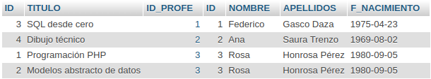

Si antes habíamos realizado el producto cartesiano entre las 2 tablas pero eso implica que debo recorrer ambas tablas de forma completa. En el caso particular de la sentencia INNER para asociar el profesor no es necesario recorrer la tabla completa, sino que se realiza un recorrido secuencial sobre la tabla PROFESORES hasta encontrarlo, puesto que en la cláusula ON estamos indicando su clave primaria. 

Veamos otro ejemplo, donde buscaremos todos los cursos que realiza el alumno con ID igual a 1:
[source,sql]
--
select C.TITULO CURSO
from ALUMNOS_CURSOS AC 
inner join CURSOS C
      on AC.ID_CURSO = C.ID
where AC.ID_ALUMNO = 1
--

Resultado:

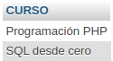

Observe como en la cláusula WHERE se establece un filtro propiamente dicho, y en la cláusula ON se establece la condición de reunión que el motor debe aplicar entre las tablas a ambos lados de la cláusula INNER JOIN.

Veamos un último ejemplo de reunión interna en la que aparezcan tres tablas, para ello tomemos otro ejemplo de la lección anterior, la reunión de los alumnos con los cursos que cursa cada uno. Tomando ejemplos equivalentes construidos únicamente con la cláusula WHERE se pueden observar mejor las diferencias.

[source,sql]
--
select C.TITULO CURSO , concat(A.APELLIDOS,', ',A.NOMBRE ) ALUMNO
from ALUMNOS_CURSOS AC 
inner join ALUMNOS A
      on AC.ID_ALUMNO = A.ID
inner join CURSOS C
      on AC.ID_CURSO  = C.ID
order by C.TITULO , A.NOMBRE , A.APELLIDOS
--

Resultado:

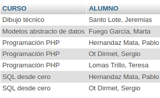

Si ahora sobre este consulta se quisiera reducir el resultado a un curso o un alumno en concreto, se añadiría la pertinente cláusula WHERE con el filtro deseado justo antes de la cláusula ORDER BY.

[.lead]
Reunión externa - left outer join / right outer join +
La reunión externa puede verse en este caso como una reunión interna donde no es necesario que el registro hijo tenga informada la clave foránea para ser mostrado, por ejemplo, cuando se mostraban los cursos junto a los profesores que los imparten, como uno de los cursos no tiene padre, es decir, no tiene un profesor asignado, o lo que es lo mismo, el campo ID_PROFE de la tabla CURSOS está a nulo, este curso no se muestra dado que no satisface la cláusula ON. Bien, este recurso nos ofrece la posibilidad de mostrar estos registros con los campos del registro padre a nulo.

La reunión externa siempre se realizaran por la izquierda o por la derecha, una de las dos. De este modo expresamos el deseo de considerar todos los registros de la tabla a la izquierda o a la derecha de la cláusula OUTER JOIN, aunque no se hallen coincidencias con la otra tabla según la cláusula ON. Veamos la consulta que muestra los cursos y sus profesores aunque el curso no tenga profesor asignado:

[source,sql]
--
select *
from CURSOS C 
left outer join PROFESORES P 
     on C.ID_PROFE = P.ID
--

Resultado:

image::./images/SQL/image_059.png[Resultado del left join entre CURSOS y PROFESORES]

Como en este caso usamos LEFT OUTER JOIN, la tabla que de la izquierda, es decir, la tabla CURSOS, será considerada por completo aunque no tenga éxito la cláusula ON, en cuyo caso los campos de la tabla situada a la derecha de la cláusula se mostrarán a nulo.

Si invertimos el orden de las tablas y usamos RIGHT OUTER JOIN, o simplemente RIGHT JOIN, expresión equivalente simplificada aplicable también a LEFT JOIN, el resultado es el mismo.

[source,sql]
--
select *
from PROFESORES P 
right join CURSOS C
    on C.ID_PROFE = P.ID
--

Resultado:

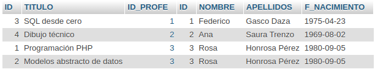

En la consulta anterior se están considerando todos los cursos aunque estos no tengan un profesor definido, si ahora usted quisiera obtener esto mismo pero añadiendo un filtro sobre la tabla PROFESORES, por ejemplo que el apellido del profesor contenga una "E", cabe esperar hacerlo en la cláusula WHERE, sin embargo también es posible aplicar el filtro en la cláusula ON. En realidad elegiremos una u otra cláusula en función de lo que deseemos obtener. Si lo hacemos en la clausula ON de un OUTER JOIN se estarán obteniendo todos los cursos con los campos de la tabla PROFESORES a nulo si la condicion establecida en la cláusula ON no tiene éxito. Si se hace en la cláusula WHERE se estará forzando a que se cumpla dicha cláusula y por tanto la reunión externa se rompe. Veamos esto con un ejemplo:

Consulta que muestra todos los cursos acompañados del profesor que lo imparte. Si el curso no tiene profesro definido o bien el campo APELLIDOS no contiene una "E", los campos de la tabla PROFESORES se mostrarán a nulo:
[source,sql]
--
select *
from PROFESORES P 
right join CURSOS C
      on C.ID_PROFE = P.ID_PROFE
      and P.APELLIDOS like '%E%' 
--

Resultado:

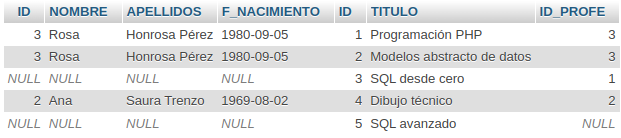

El resultado presenta para el curso 3 los campos de la tabla PROFESORES a nulo porque el campo APELLIDOS del profesor que lo imparte no contiene un "E". Para el curso 5 ocurre lo mismo pero en este caso el motivo es además que no tiene profesor definido, con que mucho menos podrá ser cierta la otra condición.

Ahora aplicamos el filtro del apellido en la cláusula WHERE:

[source,sql]
--
select *
  from PROFESORES P right join CURSOS C
    on C.ID_PROFE = P.ID
 where P.APELLIDOS like '%E%' 
--

Resultado:

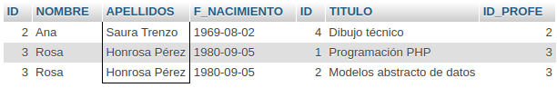

Observamos como la reunión externa se rompe puesto que la cláusula WHERE exige que el apellido del profesor contenga una "E", dado que los cursos que no tienen profesor definido la consulta devuelve el apellido a nulo, esta cláusula no se satisface por lo que oculta el registro y la reunión externa carece de sentido, o si usted quiere, la clausula WHERE es aplicable a la tabla CURSOS pero no a la tabla PROFESORES, puesto que en este caso no tiene sentido realizar una reunión externa para que luego un filtro en la cláusula WHERE la anule.

[.lead]
Vamos a ver algunos totalizadores +
Alumnos matriculados en cada curso, aunque estos sean cero:

[source,sql]
--
select C.TITULO CURSO, count(AC.ID_ALUMNO) ALUMNOS, count(C.ID) REGISTROS
from ALUMNOS_CURSOS AC 
right join CURSOS C
      on AC.ID_CURSO = C.ID
group by C.TITULO
--

Resultado:

image::./images/SQL/image_063.png[Resultado de unir ALUMNOS_CURSOS y CURSOS para totalizar alumnos]

En la anterior consulta se han contado tanto alumnos como registros para poder observar la diferencia. La única fila en que estos dos valores difieren es para el curso de SQL avanzado. Dado que la reunión externa devuelve la fila con los datos del alumno a nulo para los cursos sin alumnos, al realizar un recuento de registros el valor es uno, el registro existe, pero al realizar el recuento del campo ID_ALUMNO este es ignorado por la función COUNT por ser nulo.

Observe que en este caso la tabla que interesa tratar por completo mostrando todos sus registros es la tabla padre(CURSOS), y la tabla donde no importa que halla aciertos es la tabla hijos(ALUMNOS_CURSOS). Es decir, la consulta devuelve todos los registros de la tabla CURSOS aunque para ellos no existan hijos en la tabla ALUMNOS_CURSOS. En los ejemplos anteriores a este último, también interesaba tratar por completo la tabla CURSOS, pero esta ejercía de hijo y no de padre, y los campos de la tabla PROFESORES podían venir a nulo no porque no existiera el registro en la tabla PROFESORES que también, sino como consecuencia de que el campo ID_PROFE de la tabla CURSOS contenía un valor nulo.

== Funciones

[.lead]
CONCAT +
Realiza la concatenación de dos o más cadenas de texto. Los parámetros de entrada en este caso son tantas cadenas como deseemos separadas por comas, y el resultado que devuelve es una única cadena con la concatenación de todas las cadenas de entrada.

[source,sql]
--
select concat('Esto ','es ','un ','ejemplo ',
              'de ','concatenación ', 'de ', 'textos.') as RESULTADO
--

Resultado:

image::./images/SQL/image_064.png[Resultado de la concatenación]

[.lead]
LOCALTIME +
Retorna la fecha y hora del servidor.

[source,sql]
--
select localtime as RESULTADO
--

Resultado:

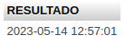

[.lead]
CURRENT_DATE +
Retorna la fecha del servidor

[source,sql]
--
select current_date as RESULTADO
--

Resultado:

image::./images/SQL/image_066.png[Resultado de obtener la fecha del servidor]

[.lead]
DATE_FORMAT +
Se utiliza para formatear fechas. Esta función precisa dos parámetros, en primer lugar el dato de tipo fecha que se quiere formatear, y seguidamente la máscara que determina el formato. La máscara puede variar según el motor de base datos.

[source,sql]
--
select date_format(localtime,'%m-%Y') as RESULTADO 
--

Resultado:

image::./images/SQL/image_067.png[Resultado de formatear la fecha]

Para mostrar por ejemplo los datos de la tabla EMPLEADOS con este formato para el campo F_NACIMIENTO podríamos construir la siguiente consulta:

[source,sql]
--
select ID, NOMBRE, APELLIDOS, F_NACIMIENTO, date_format(F_NACIMIENTO,'%d-%m-%Y') F_NACIMIENTO_FORMATEADA
from EMPLEADOS;
--

Resultado:

image::./images/SQL/image_068.png[Resultado de formatear la fecha]

[.lead]
DATE_ADD / DATE_SUB +
Se utiliza para agregar / quitar valores a las fechas. Como parámetros recibe la fecha y el intervalo de valor. Se pueden agregar  días, meses, años, horas, minutos.... Los intervalos pueden variar según el motor de base de datos.

[source,sql]
--
select date_add(current_date, INTERVAL 30 DAY) FECHA_ACTUAL_MAS_TREINTA_DIAS,
       date_add(current_date, INTERVAL 6 MONTH) FECHA_ACTUAL_MAS_SEIS_MESES,
       date_sub(current_date, INTERVAL 30 DAY) FECHA_ACTUAL_MNEMOS_TREINTA_DIAS,
       date_sub(current_date, INTERVAL 6 MONTH) FECHA_ACTUAL_MENOS_SEIS_MESES;
--

Resultado:

image::./images/SQL/image_069.png[Resultado agregado de valores a la fecha]

[.lead]
DATEDIFF +
Retorna los días de diferencias entre dos fechas. Como parámetros recibe las 2 fechas a comparar. +
Vamos a tomar la tabla VEHICULOS, donde se guardaba para cada unidad la fecha de la próxima revisión, se preguntará quizás como realizar una consulta que informe de los vehículos que deben pasar la revisión en los próximos 30 días:

[source,sql]
--
select *, datediff(PROX_ITV, CURRENT_DATE) as DIAS_DIFERENCIA
from VEHICULOS
where datediff(PROX_ITV, CURRENT_DATE) < 31;
--

Resultado:

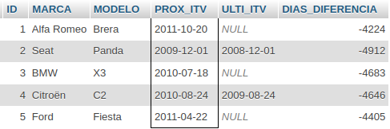

[.lead]
SUBSTR +
Retorna el substring de una cadena. Como parámetros recibe el dato de tipo cadena a tratar en primer lugar, seguido de la posición dentro de la cadena donde se quiere obtener la subcadena, y por último la longitud o número de caracteres de esta. Ejemplos:

[source,sql]
--
select substr('ABCDEFGHIJ',1,4) LOS_CUATRO_PRIMEROS_CARACTERES,
       substr('ABCDEFGHIJ',4) TODAS_A_PARTIR_DE_LA_CUARTA,
       substr('ABCDEFGHIJ',-3, 2) LAS_ULTIMAS_DOS_ANTES_DE_LA_ULTIMA,
       substr('ABCDEFGHIJ',-3) LAS_ULTIMAS_TRES;
--

Resultado:

image::./images/SQL/image_071.png[Resultado de substring]

[.lead]
REPLACE +
Remplaza en una cadena un texto por otro. Como parámetros recibe la cadena, el texto a buscar y el texto de reemplazo.

[source,sql]
--
select REPLACE('Mantel de color &','&','naranja') as PRODUCTO
--

Resultado:

image::./images/SQL/image_072.png[Resultado del reemplazo de cadenas]

[.lead]
IF +
Es el condicional simple y puede variar dependiendo del motor de base de datos. La función IF en este caso interroga si el campo RUBIA contiene un 'S', si es así devuelve 'Sí', en caso contrario devuelve 'No'.

[source,sql]
--
select NOMBRE , RUBIA, if(RUBIA='S','Sí','No') RUBIA_IF
from PERSONAS
--

Resultado:

image::./images/SQL/image_073.png[Resultado ejemplo if]

[.lead]
ROUND +
Permite redondear un número.

[source,sql]
--
select round(7.64739836953 , 2) as RESULTADO
--

Resultado:

image::./images/SQL/image_074.png[Resultado de ROUND]

[.lead]
TRUNCATE +
Trunca un número por la parte decimal que se le indique, pudiendo así considerar únicamente la parte entera.

[source,sql]
--
select truncate(7.64739836953 , 2) as RESULTADO
--

Resultado:

image::./images/SQL/image_075.png[Resultado de TRUNCATE]
