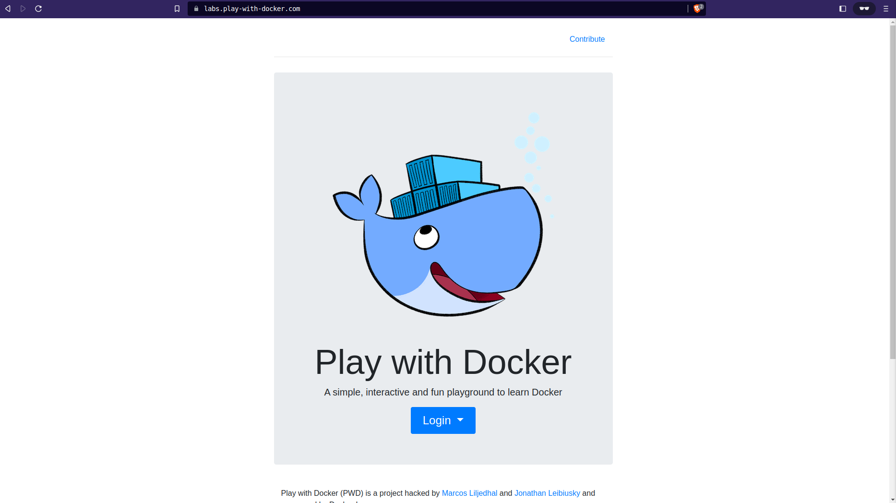
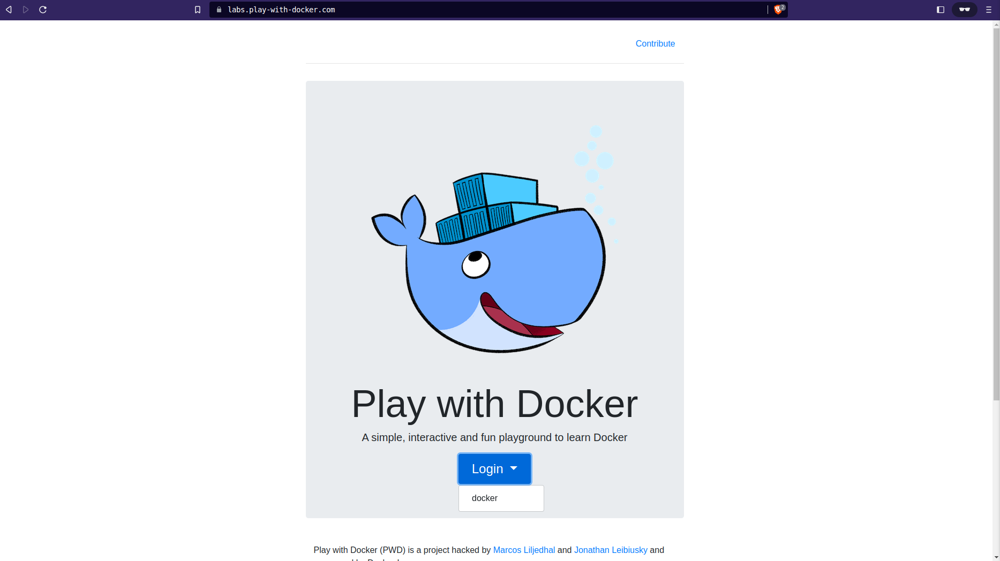
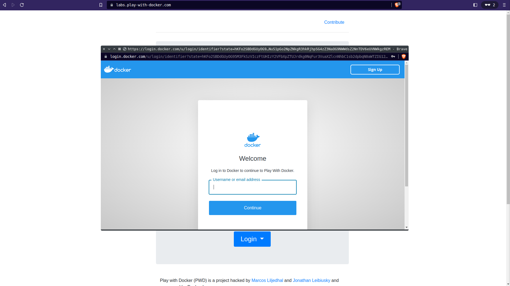
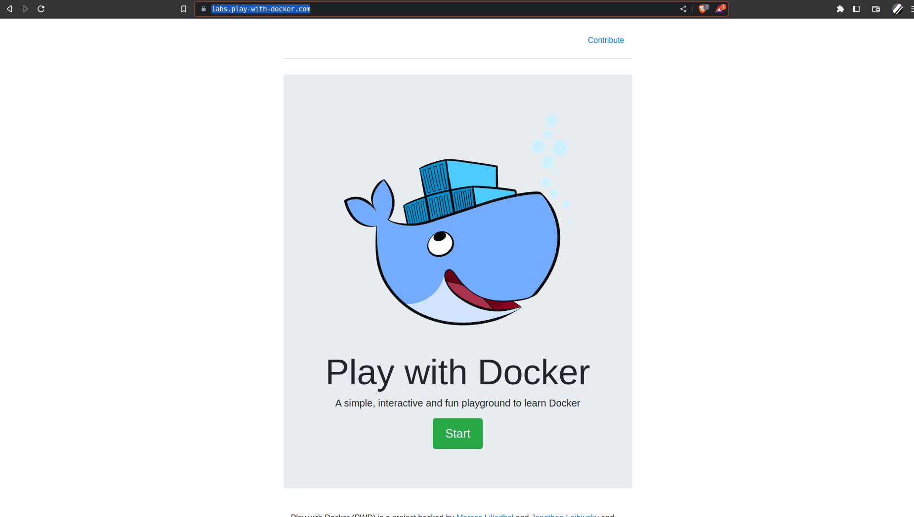
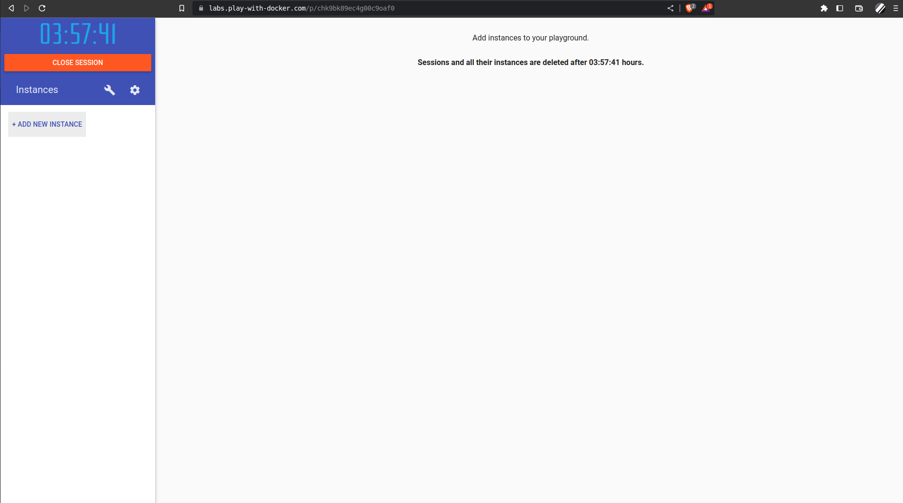
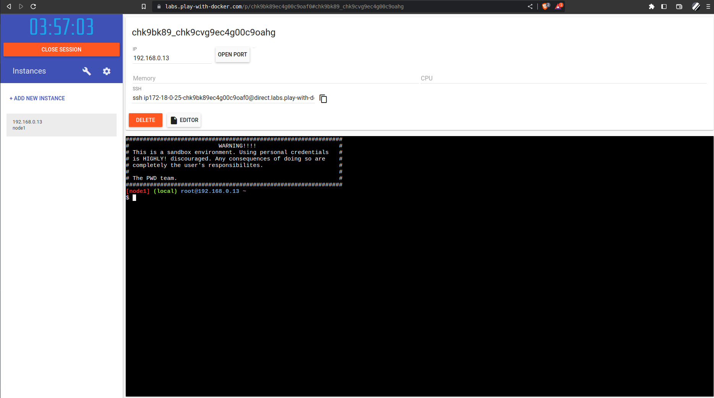
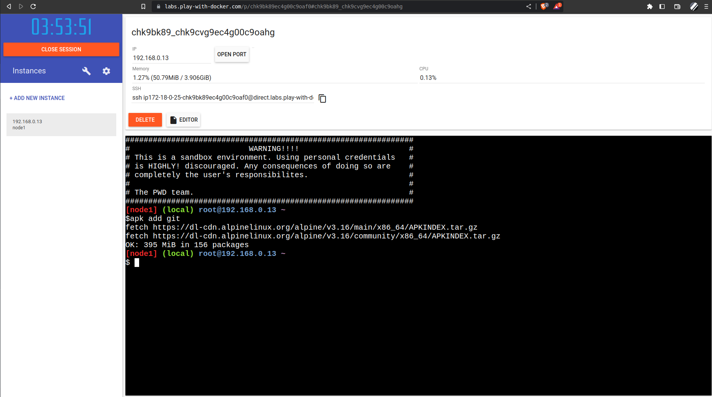
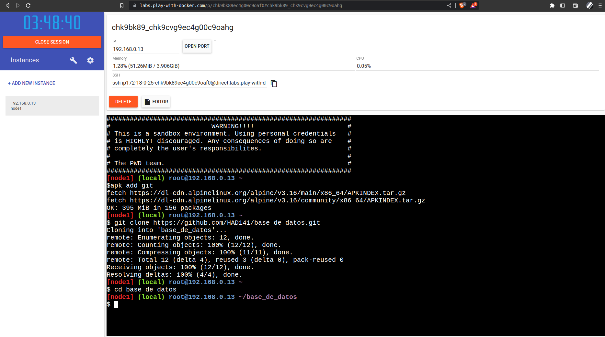
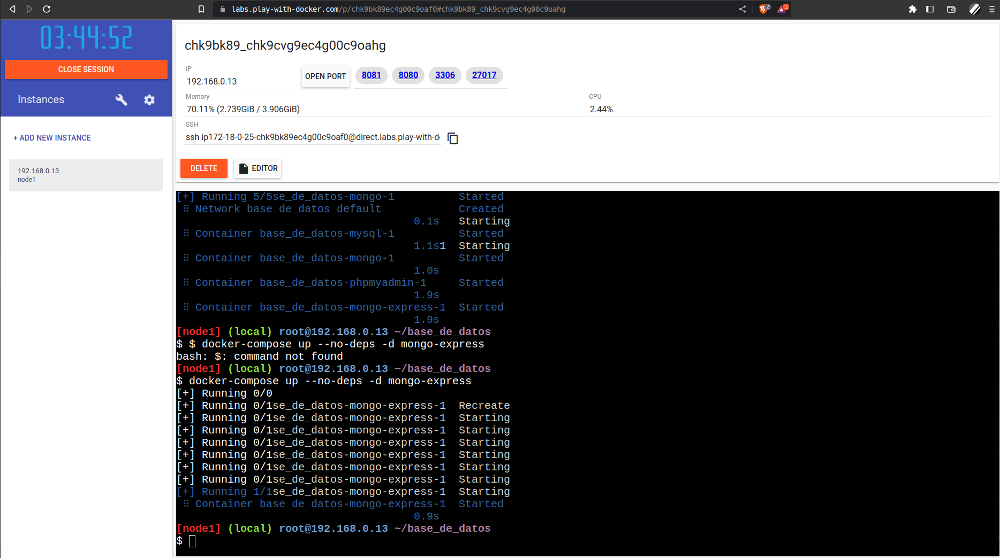

= Preparando el entorno

== Utilizando contenedores de forma local

La ventaja de utilizar contenedores es que ya está todo configurado y funcionando.

=== Página web (play-with-docker)

También se puede utilizar la plataforma https://labs.play-with-docker.com/[play-with-docker] donde ya se encuentra instalado.

Debemos crearnos un usuario en la página de https://hub.docker.com[docker hub] para poder utilizarla y nos permite utilizar recursos por 4 horas.

Pantalla de bienvenida

Login

Login o creación del usuario en docker hub

Ingresando a la administración

Pantalla de administración

image::./images/Instalacion/pwd_05.png[Pantalla de administración]

Una vez que estamos dentro de la pantalla de administración debemos agregar una instancia con el botón *+ ADD NEW INSTANCE*.

Creación de una nueva instancia

Instancia creada

Ahora estamos en una terminal linux de apline y podemos ejecutar cualquier comando linux. El comand para instalar programas utilizamos la herramienta *apk*.

Para poder clonar el repositorio debemos instalar git con el siguiente comando:

[source,bash]
--
$ apk add git
--

Instalando git

Clonación del repositorio y entrando al directorio del repositorio

[source,bash]
--
$ git clone https://github.com/HAD141/base_de_datos.git
$ cd base_de_datos
--

Lanzando los sevicios

[source,bash]
--
$ docker-compose up -d 
# esperar unos 10 segundos y ejecutar, esto es porque el administrador de mongodb
# se lanza antes de que se inicie la base datos
$ docker-compose up --no-deps -d mongo-express
--

Como podemos ahora aparece números de puertos abiertos en la parte derecha de del botón *OPEN PORT*. Cada número es un puerto abierto y si le accemos click accedemos a un servicio. +
Descripción de los puertos:

- 8081: Es el servicio de mongo-express o el administrador de mongodb.

- 8080: Es el servicio de phpMyAdmin o el administrador de mysql.

- 3306: Es el motor de base de datos de mysql.

- 27017: Es el motor de base de datos de mongodb.

=== Instalación de docker en forma local
Necesitamos instalar https://www.docker.com/products/docker-desktop/[docker]

Instalar en https://docs.docker.com/desktop/install/windows-install/[windows].

=== Ejecución de los contenedores

Una vez instalado docker o entrado a la web de play-with-docker debemos ejecutar los siguientes pasos.

[.lead]
Lanzar los contenedores

debemos clonar el repositorio ....
y lanzar los contenedores. De esta forma ya tendremos corriendo y configurado todo lo necesario. Las prácticas fueron generadas de esta forma.

== Instalando los servicios a mano

=== Base de datos relacional (SQL)

Instalar https://dev.mysql.com/downloads/[mysql]
Instalar algún administrador de base de datos. Dejo algunos ejemplos:

- https://dbeaver.io/download/[dbeaver]
- https://dev.mysql.com/downloads/workbench/[MySQL Workbench]
- https://www.phpmyadmin.net/[phpmyadmin]

=== Base de datos no relacional (NoSQL)

Instalar https://www.mongodb.com/try/download/community[mongodb]
Instalar algún administrador de base de datos. Dejo algunos ejemplos:

- https://github.com/mongo-express/mongo-express[nomgoexpress]

